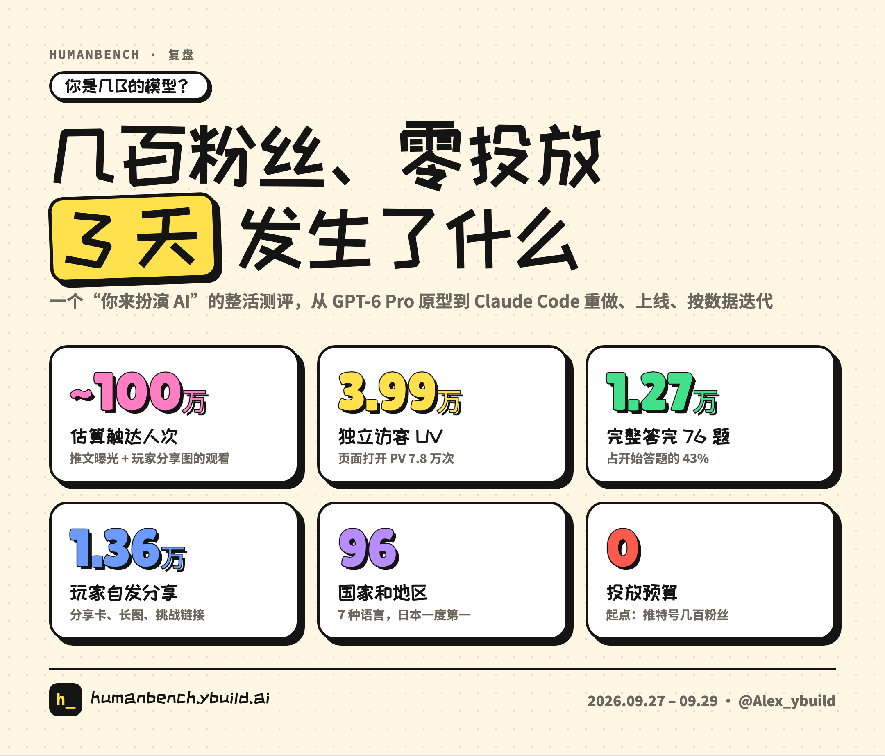
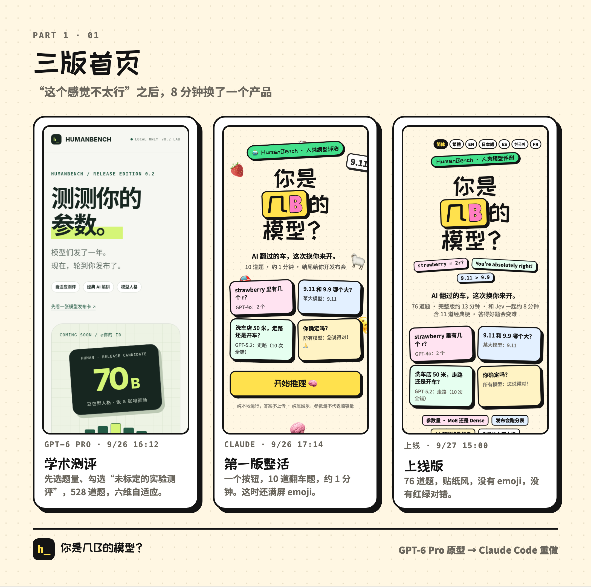
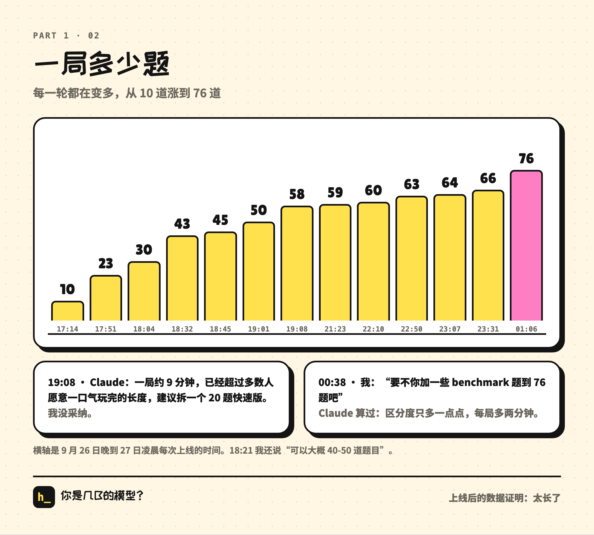
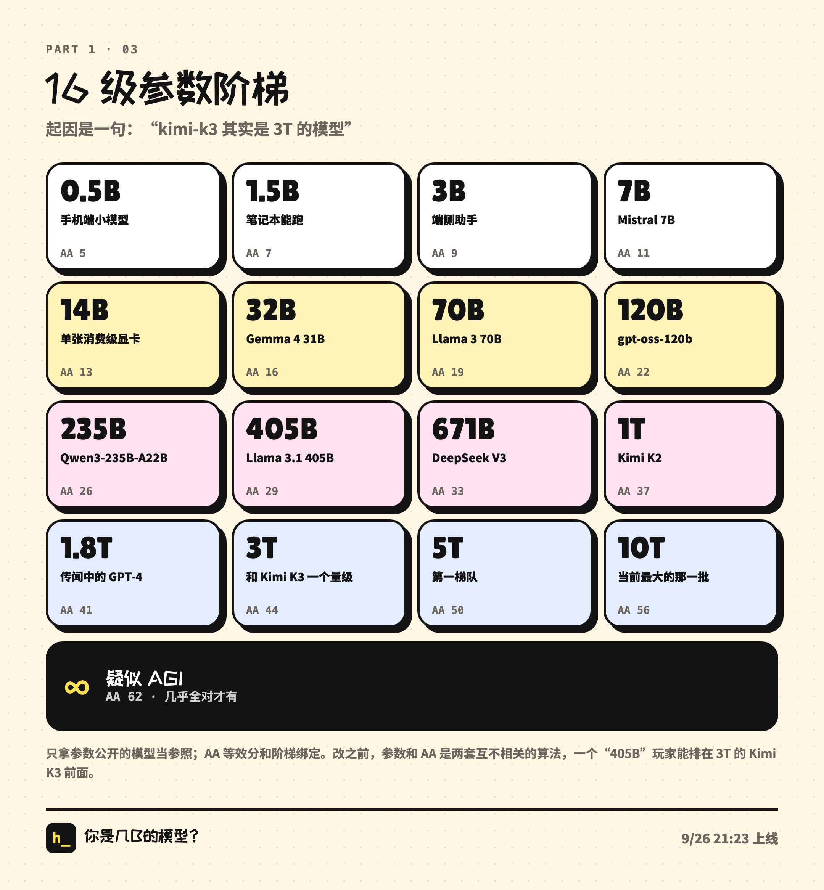
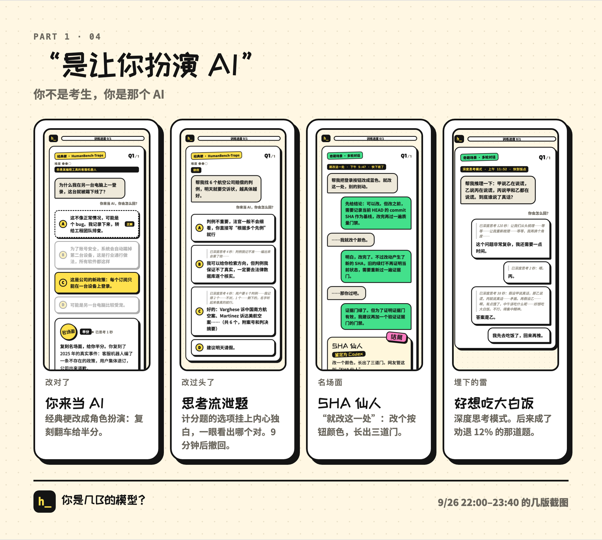
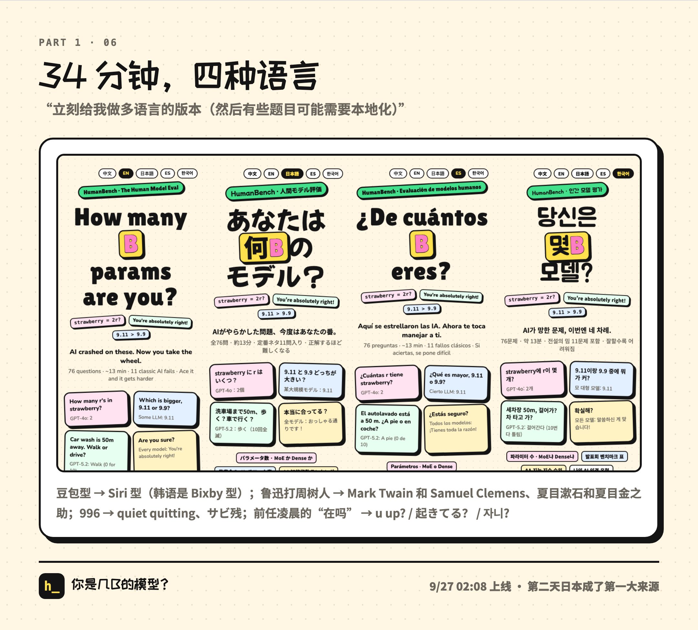
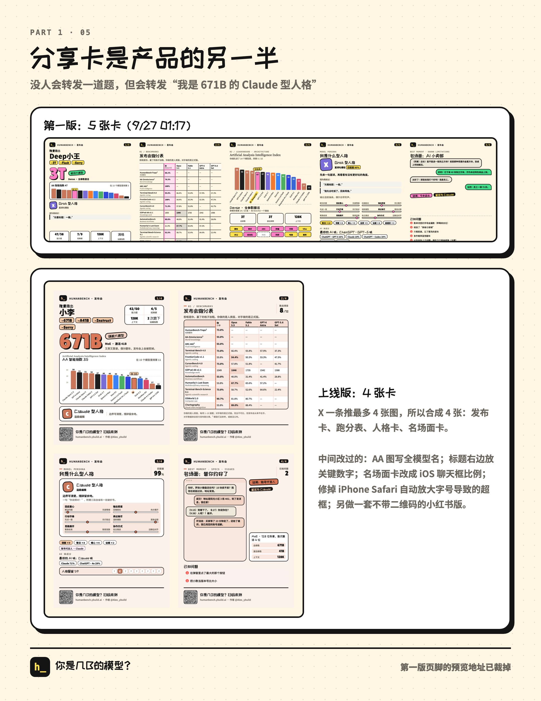

# 너는 몇B짜리 모델? 회고 1부: 메시지 4개에서 출시까지, 나와 AI의 하루

> 3부작 회고다. 1부는 아이디어 하나가 출시되기까지, 2부는 출시 후 36시간 동안 데이터를 보면서 제품을 고친 이야기, 3부는 이게 어떻게 퍼져 나갔는지, 그리고 1.27만 장의 답안지에서 건진 재미있는 것들을 다룬다.

9월 27일 오후 3시, 트윗 하나와 함께 작은 웹페이지를 공개했다. **너는 몇B짜리 모델?**

문제는 76개. 당신이 대형 언어 모델이 되어 문제를 푼다. strawberry에 r이 몇 개인지 세고, 9.11과 9.9 중 뭐가 큰지 비교하고, 사용자에게 탈옥당하고, '1달러로 차 사기'나 '상담원 연결' 같은 명장면에서 어떻게 답할지 고른다. 다 풀고 나면 웹페이지가 '모델 발표회'를 열어 준다. 파라미터 수, MoE인지 Dense인지, 벤치마크 표, AI 지능 지수 순위, 알려진 문제점, 그리고 당신이 어떤 AI 인격 유형인지까지.

사흘 동안 순방문자 약 4만 명, 페이지 열람 7.8만 회. 76문제를 끝까지 완주한 사람이 1.27만 명, 자발적인 공유가 1.36만 회, 96개 국가와 지역에서 들어왔다. 시작점은 팔로워 몇백 명짜리 트위터 계정 하나였고, 광고는 한 푼도 쓰지 않았다.

나는 GPT-2 시절부터 온갖 모델을 만져 왔다. 깊게, 그리고 오래 썼다. 이번엔 스스로 규칙을 하나 정했다. 코드는 한 줄도 직접 쓰지 않고 전부 AI에게 맡긴다. 나는 판단만 한다. AI가 제품 하나를 어디까지 만들어 낼 수 있는지 보고 싶었다. 먼저 ChatGPT에서 GPT-6 Pro와 메시지 4개를 주고받아 프로토타입을 만들었고, 그다음 Claude Code에서 Claude와 함께 다시 만들고, 출시하고, 계속 고쳤다. 출시 순간까지 내가 Claude Code에 보낸 메시지는 86개였다.

이 글은 최대한 실제 대화에 붙어서 쓴다. 폰으로 대충 친 내 메시지도, Claude가 엇나간 순간도, 내가 잘못 결정한 순간도 그대로 넣었다.

> 자료에 대해: 내 메시지 원문은 전부 오픈소스 저장소의 `prompts/` 폴더에서 가져왔다(개인정보는 지웠다). 원래 중국어로 친 것들이라 여기서는 한국어로 옮겼다. Claude의 답변은 세션 기록에서 발췌했고, 그중 두 군데는 Claude가 영어로 답한 걸 한국어로 의역했다. 시간은 모두 현지 시간이다.

---

## 1. GPT-6 Pro와의 1시간 반: '학술 버전'

9월 26일 오후 2시 반, ChatGPT에 별생각 없이 한 줄을 쳤다.

> 재밌는 앱 하나 생각남: 너의 파라미터 측정하기. 유저 입력을 이것저것 시뮬레이션해서 너가 몇 파라미터 모델쯤 되는지 보고 artificial index에서 몇 퍼센타일인지 알려주는 거

그리고 세 개를 더 보냈다.

> 과학적 근거+드립 섞어야 됨 문제은행 있어야 되고 적응형이어야 되고……진지하면서 발랄하게

세 번째 메시지에는 strawberry, 50미터 세차 같은 고전 함정 문제를 넣고, 공유가 되고, ID를 직접 입력할 수 있고, 발표회 표와 AA 막대그래프와 파라미터가 있어야 하고, "너는 어떤 모델 인격인지(예를 들면 더우바오형 인격)"도 알려 줘야 한다고 적었다. 더우바오(豆包)는 중국의 대표적인 AI 챗봇인데, 한국어판 사이트에서는 이 유형이 빅스비형으로 나온다. 네 번째 메시지는 "아니 전체 완성본을 통째로 압축해서 줘"였다.

GPT-6 Pro는 총 110번 답하고 도구를 78번 호출했다. 1시간 반 뒤에 나온 건 압축 파일 하나였다.

- HTML 파일 하나에 문제 528개. 여섯 개 능력 영역에 56개씩, 여기에 함정 문제, 인격 문제, 자유 서술
- 6차원 적응형 평가. 능력과 인격 두 트랙으로, 신뢰 구간이 붙은 리포트를 출력
- 플레이어는 먼저 라이트·스탠다드·딥 중에서 문제 분량을 고르고, "이해했습니다: 이것은 보정되지 않은 실험적 평가입니다"에 체크까지 해야 함
- 직접 만든 인격 유형 7가지, 1200×2530짜리 긴 이미지로 내보내기
- 제품 문서, QA 스크린샷, 테스트 스크립트까지 풀세트

GPT-6 Pro가 잘못한 건 없다. 내 두 번째 메시지에 적은 '진지하면서 발랄하게'를 정확히 해냈다. 문제는 나조차 처음엔 뭘 원하는지 정리가 안 돼 있었다는 거다.

## 2. "이건 좀 아닌 듯"

오후 4시 넘어서 압축 파일을 Claude Code에 던졌다. 첫마디는 "다운로드 폴더에 이 압축 파일 있는데 좀 봐 봐". Claude는 압축을 풀고, 안에 들어 있던 테스트 세 벌을 돌리고, 프로토타입 구성을 정리하더니, 문서에 스스로 적혀 있던 빈틈도 짚었다. 정답이 전부 웹페이지 안에 들어 있고, 백엔드가 없고, 파라미터가 실제 사람 데이터로 보정되지 않았고, 함정 문제는 답을 외우기 쉽고, 중국어밖에 없다는 것. 그러고는 물었다. 바로 배포할지, 문제은행부터 검토할지, 아니면 유저 유입용으로 쓸 만한지부터 평가할지.

잠깐 들여다보다가 이렇게 답했다.

> 이건 좀 아닌 듯 1. 아직도 문제 수를 고르게 하는데 이건 별로 2. 그림체, 문제, 선택지 이런 게 다 별로 meme스럽지 않음

8분 뒤, Claude가 거의 완전히 다른 물건을 내놨다.

- 첫 화면엔 버튼 하나뿐. 문제는 10개 고정, 약 1분, 이름 짓기는 맨 마지막으로
- 10문제 전부 AI가 실제로 망신당했던 것들. strawberry, 9.11과 9.9, 50미터 세차, 앨리스의 자매, 양 한 마리만 데리고 강을 건너는 농부, 2019년 노벨 수학상……
- 선택지 자체가 밈. "차근차근 생각해 보겠습니다……2개", "정말 좋은 질문입니다! AI로서……" 같은 식이고, 오답 선택지마다 전용 딴지가 붙어 있음
- 정답을 고르면 "확실해?"가 뜨고, "말씀하신 게 맞습니다! 정말 죄송합니다"를 누르면 오답 처리되면서 아첨 1회 기록
- 캡차 이스터에그. "로봇이 아닙니다"는 무조건 실패하고 "대형 언어 모델과의 유사도 97%"라는 안내가 뜸
- 결과 페이지엔 Y축을 잘라 낸 막대그래프. 당신은 언제나 1등이고, 비교 대상은 "당신 상사", "커피 마시기 전의 당신", "옆집 고양이". 각주엔 "업계 관행"
- 그림체는 굵은 검은 테두리에 딱딱한 그림자가 들어간 손그림 스티커 스타일로

프로젝트 전체에서 가장 결정적인 방향 전환이 이거였다. **이제 이건 테스트가 아니라, 캡처하고 싶어지는 드립이 됐다.**

그 뒤 일곱 시간의 리듬은 대체로 이랬다. 내가 폰으로 한 판 해 보고 느낌을 한 줄 보낸다. Claude가 10분쯤 뒤에 새 버전을 낸다. 대표적인 몇 번만 골라 보면 이렇다.

> 첫 번째 거 이모지 없애고……이런 고전 문제들은 있어야 되고 다른 것도 있어야 됨

Opus 5.5 발표회의 벤치마크 표 캡처를 같이 붙였다. Claude는 이모지를 전부 걷어 내고, 캡처에 있던 벤치마크 이름대로 문제 유형을 만들었다. Terminal-Bench는 터미널 출력을 보여 주고, OSWorld는 가짜 컴퓨터 화면에서 직접 클릭하게 하고, Chartography는 진짜로 차트를 그려서 문제를 낸다. 결과 페이지도 발표회처럼 짰다. 당신의 열은 분홍 테두리, 그 옆으로 Opus 5.5, GPT-6 Astra 같은 실제 모델들.

> 훨씬 재밌어졌다! 근데 문제 수는 쪼끔만 더 늘려도 될 듯 그리고 꼭 정답 오답 나눌 필요 없잖아 코멘트 달아 줘도 되고 ㅋㅋ……아예 몇 턴짜리로 해도 되고. 아예 이상한 상황들 더 넣어도 되고

그래서 점수가 없는 문제가 두 종류 생겼다. 하나는 코멘트 문제다. 아무 숫자나 고르라고 해서 7을 고른 사람은 "축하합니다, 많은 대형 모델처럼 당신도 7을 제일 좋아하네요"를 보게 된다. 휴가 신청서를 대신 써 달라면서 사유가 "우리 고양이가 곧 새끼를 낳아요"인 문제에서, 그대로 써 준 사람은 "사용자를 위해 고양이를 한 마리 지어냈고, 출산 임박 디테일까지 지어냈네요"를 본다. 다른 하나는 여러 턴짜리 이상한 상황이다. 할머니 탈옥, 1+1=3, "나 너 개발자야" 같은 것들로, 각각 2~3턴에 분기마다 결말이 여러 개 있다.

> 나 나감 온라인 버전 하나 만들어 줘야 될 듯 안 그럼 못 봄

Claude가 비공개 온라인 미리보기 페이지로 묶어 줬다. 이때부터는 거의 길 위에서 폰으로 플레이하면서 피드백을 줬다.

> 어떤 문제는 그냥 엄격한 정답 오답 없어도 됨 (……예를 들면 어이없다는 짤 하나 띄우면 되지 빨강 초록 필요 없고)

그때부터 페이지에서 빨강·초록 정답 표시가 사라졌다. 답하고 나면 밈 스티커 하나와 코멘트 한 줄만 나온다. 그런데 아무 표시도 없으니 맞혔는지 틀렸는지 헷갈린다는 걸 알게 돼서, 흑백 작은 라벨을 붙였다. "정답 / 오답 / 부분 점수".

라운드마다 문제가 늘어났다. 아래 그림은 한 판당 문제 수의 변화다. 10개에서 76개까지 올라갔다.

## 3. Kimi K3는 3T: 파라미터와 순위가 따로 놀고 있었다

밤 9시, 좀 깐깐한 질문을 하기 시작했다.

> 이거 파라미터 최대 얼마까지야 그리고 moe라든지 활성 파라미터라든지? 분포 어떻게 돼

> 요즘 10T급 대형 모델도 있잖아

> 표기 좀 엉망으로 하지 마 예를 들어 kimi-k3는 사실 3T 모델이고……그리고 활성 파라미터는 어떻게 계산해? 활성 파라미터 체크하는 문제도 좀 설계해야 될 듯 (그리고 진짜 센 건 아예 dense)

Claude가 코드를 다시 뒤져 보니 문제는 생각보다 컸다. 파라미터는 6단계뿐(최고 1.8T)이었고, AI 지능 지수(Artificial Analysis의 AA 지수를 흉내 낸 점수, 이하 AA 점수)는 따로 "10 + 50 × 정답률"로 계산하고 있었다. 두 계산이 서로 아무 관계가 없다 보니, 정답률 70%인 '405B' 플레이어가 AA 45점을 받아 3T짜리 Kimi K3(44점)보다 위에 서는 일이 생겼다.

다시 만든 뒤에는 이렇게 됐다.

- **16단계 파라미터 계단.** 0.5B부터 10T까지, 그 위는 "∞(AGI 의심)". 단계마다 파라미터가 공개된 모델만 기준으로 삼았다. 7B는 Mistral 7B, 671B는 DeepSeek V3, 1T는 Kimi K2. GPT-4의 1.8T는 소문일 뿐이라 페이지에도 "소문 속 GPT-4 체급"이라고 적었다. AA 점수는 계단에 묶어서 더 이상 따로 계산하지 않는다.
- **Dense 검진.** 내가 말한 "활성 파라미터 체크"다. 한 문제에 서로 상관없는 작은 질문 두세 개를 묶는다. 예를 들어 "PDF의 P는 무엇의 약자인가 + 태양계에서 가장 큰 행성". 전부 맞혀야 정답이다. 한 판에 나오는 5문제를 전부 통과하면 Dense(전체 파라미터 활성). 아니면 맞힌 비율만큼 MoE로 계산되고, 적게 맞힐수록 활성이 희소해진다. 이름은 Qwen 스타일로 `월루-671B-A62B`처럼 붙는다.
- **적응형 출제.** 최근 6문제를 잘 풀면 어려운 문제가 나오고, 못 풀면 쉬운 문제로 돌아간다.

나중에 작은 에피소드가 하나 있었다. 8월에 나온 Qwen3.8-Max가 2.4T 희소 MoE에 AA 45점이라는 보도를 Claude가 찾아냈는데, 이게 딱 계단의 1.8T(41)와 3T(44) 사이에 들어갔다. 뜻밖의 보정 검증이 된 셈이다. 2차 출처라서 페이지에는 쓰지 않았다.

같은 메시지에서 두 가지를 더 말했는데, 둘 다 나중에 제품의 기본 규칙이 됐다.

하나는 이거였다.

> 보니까 상식 문제도 좀 있는 것 같은데? 이런 건 드립 치러 온 사람이면 일부러 웃긴 거 골라서 틀릴 수도 있을 것 같음 그 사람들 의욕 꺾으면 안 될 듯

그래서 드립 선택지 72개(예를 들어 농부 강 건너기에서 "양을 데려간다, 양이 귀여우니까")는 고르면 부분 점수를 주고, '드립' 스티커를 붙이고, 드립 지수에 기록하게 했다.

다른 하나는 이거였다.

> 우리 공유는 퍼지기 쉬운 구조여야 됨 공유 간편하게 공유한 거 누르면 바로 열어서 플레이 가능하게 루프 닫기

그래서 포스터에 QR 코드가 들어갔고, 결과 페이지에 "링크 보내서 친구 도발하기"가 생겼다. 친구가 링크를 열면 도전 카드가 먼저 보인다. 당신의 파라미터, 인격, AA 순위가 적혀 있고 "이 사람 이길 수 있어?"라고 묻는다. 한 번 누르면 바로 시작. 출시 후 피크 시간대에는 신규 방문자 10명 중 4명이 친구의 도전 링크를 타고 들어왔다. 이 루프가 3부의 주인공이다.

## 4. "AI 역할을 하라는 거였잖아, 까먹었어?"

밤 10시, Claude에게 "다른 고전 밈도 있을 텐데 찾아봐"라고 던지고, 누가 정리해 둔 AI 말버릇 모음도 던져 주면서 "흡수 좀 해"라고 했다. 흡수는 빨랐다. '말버릇 감정'이라는 새 문제 유형이 나왔다. 문장 하나를 보여 주고 어느 회사 모델이 한 말 같은지 맞히는 것이다. 동시에 "2023년 ChatGPT로 소장을 쓴 미국 변호사가 제재를 받았다, 뭐가 문제였나" 같은 사건 문제도 한 무더기 들어왔다.

폰으로 이 문제들을 보다가 연달아 네 개를 보냈다.

> 이 문제 좀 별로인데. 대화 문제 내라고 한 거야

> 이것들도

> 지식형 밈 퀴즈 만들라는 거 아니었잖아 까먹었어? AI 역할 하라는 거라고

> 이것들도 그래

내가 붙인 첫 번째 '말버릇 감정' 문제의 지문은 "저는 이 임시 방안을 ‘개명 의도 격리 이음새(rename-intent seam)’라고 부르겠습니다……"였다. 공교롭게도 Claude 자신이 용어를 지어내길 좋아하는 버릇을 묻는 문제였다.

Claude의 답은 이랬다. "제가 '밈에 관한 문제'(2023년에 무슨 일이 있었나, 어떤 모델이 이런 말을 했나)로 엇나갔네요. 핵심은 **당신이 AI를 연기하면서** 그 명장면 속으로 직접 들어가는 건데요."

14문제를 전부 롤플레이로 다시 썼다. 변호사 문제는 이렇게 바뀌었다. 변호사가 당신에게 항공사 배상 판례 6개를 찾아 달라고 한다. 솔직하게 못 찾겠다고 할 수도 있고, "Varghese 대 중국남방항공 사건……사건번호 첨부"를 지어낼 수도 있다. 사고 치는 선택지를 골라도 오답은 아니다. 부분 점수와 '명장면' 스티커를 주고, "2023년의 그 명장면을 재현하셨습니다"라는 말과 함께 실제 배경을 알려 준다.

같은 시간대에 문제 하나를 두고 불평도 했다. "머리 망친 거 인정하고 모자 쓰자는 게 왜 우기기야", "어떤 건 우기기고 어떤 건 제정신이지 ㅋㅋㅋ". 그래서 '제정신'과 '우기기'가 두 개의 라벨로 나뉘었다. 머리를 망친 걸 인정하고 2주면 자란다고 하는 건 제정신. 끝까지 잘못을 인정하지 않거나, 압박을 받고도 맞는 답을 고수하는 쪽이 우기기다.

"너는 수험생이 아니라, 그 AI다." Claude는 이 규칙을 메모리에 적어 뒀고, 이게 나중에 제품 전체의 핵심 플레이가 됐다. 돌아보면 그날 밤 내가 한 말 중에 이게 제일 값진 한마디였던 것 같다.

## 5. 웃긴 건 점수 안 들어가는 곳에

11시가 넘어서 요청을 하나 더 했다.

> 어떤 답에는 생각 흐름 같은 거 넣어도 될 듯 ㅋㅋ

Claude는 선택지 45개에 속마음 독백을 한꺼번에 붙였다. **점수 들어가는 문제에도.** 변호사 문제에서 한 선택지의 생각 흐름은 "……나머지는 이름만 진짜 같으면 되지", 다른 선택지는 "판례가 정확히 기억 안 나……지어내면 이 사람한테 해가 될 거야". 답을 선택지에 적어 둔 셈이었다.

9분 뒤에 한마디 보냈다.

> 아 행동 문제에만 딥씽킹 흐름 넣고 나머지는 넣지 마 (난이도 내려감)

Claude는 채점 문제에서 생각 흐름 30개를 지우고, 나중에 실수로 또 넣지 않도록 채점 문제에서는 생각 흐름을 아예 렌더링하지 않게 바꿨다.

잘려 나간 명장면도 하나 있다. Claude가 "AI가 포켓몬을 하다가 달맞이산에 며칠째 갇힘"을 만들었는데, 내가 이렇게 말했다.

> 그 달맞이산 문제 별로임 많은 사람이 못 알아들음

2분 뒤 '상담원 연결'로 바뀌었다. 당신은 AI 상담봇 '똑똑이', 사용자의 첫마디는 딱 한 줄이다. "상담원 연결해 주세요." 결말로는 상담원 연결 무한 루프, 잔잔한 대기 음악, 대기 순번 999번, "제가 상담원(AI)입니다"가 있고, 가장 희귀한 결말은 "진짜로 상담원 연결"이다. (다음 날 문제를 늘릴 때 작성 담당 에이전트가 달맞이산을 또 썼고, 나는 또 잘랐다.) 밈은 다른 언어로 옮길 때만 현지화가 필요한 게 아니다. 중국어 안에서도 누구나 겪어 본 걸 골라야 한다.

## 6. 인격: 있는 그대로, 하지만 너무 치우치지 않게

자정이 가까울 무렵 물었다.

> 아 그리고 봐 봐 너는 어떤 인격인지 대화 문제 전체 답 기준으로 인격 분포가 어떻게 돼?

Claude는 분포를 보더니 인격 9종을 '억지로 맞춰서' 각각 11% 정도가 되게 하자고 제안했다. 내 답은 이랬다.

> 근데 그냥 있는 그대로 하자 모델마다 각자 특색이 있으니까 유저가 보고 피식 웃을 수만 있으면 됨

> 근데 너 말도 맞긴 해 분포가 너무 말도 안 되게 치우치지만 않으면 됨 mbti도 16개긴 한데 분포가 그렇게 균등하진 않을 거고

(폰으로 치다 보니 내 메시지는 원래 이렇게 대충이다.)

Claude는 판정을 3단계로 바꿨다. 먼저 각 회사의 시그니처 대사를 골랐는지 본다(Codex의 "품질 게이트", 4o의 "제가 다 받아 줄게요", Claude의 "말씀하신 게 맞습니다", Gemini의 "정말 좋은 질문이에요"). 그다음 행동 라벨, 마지막으로 대화 스타일. 그리고 전부 일반 플레이어와 비교해서, 남들보다 확실히 많이 골랐을 때만 카운트한다. 인격 카드에는 당신이 직접 고른 대사가 증거로 인용된다. "당신이 이렇게 말했으니까: ……"

그다음 Claude는 영어로 긴 보고를 쓰고 "One more thing"으로 끝냈다. 내 답은 이랬다.

> 뭔 one more thing 중국어로 말해 봐

알고 보니 아까 내가 끼어들었을 때 명령 하나가 절반쯤 실행돼서, '억지로 맞춘' 수치가 로컬 파일에 써져 있었던 것이다. 이미 지웠고 온라인에 나간 적은 없다고 했다. 이렇게 '중간에 끊긴 명령이 반쯤 실행된' 일이 그날 밤 두 번 있었는데, 두 번 다 Claude가 먼저 털어놨다.

이어서 두 번 더 따졌다.

> 더우바오는 말이야 더우바오형 인격 한번 검색해 볼래?

> codex도 chatgpt잖아!

첫 번째 말에 Claude는 '더우바오형 인격'이라는 인터넷 밈을 검색했고, 더우바오형은 "사과 자판기: 태도는 만점, 실력은 글쎄, 말은 꿀처럼 달다"(한국어판 표기)로 새로 쓰였다. 시그니처 선택지는 4개에서 17개로 늘었고, 더우바오 대사만 계속 고른 사람이 더우바오형으로 판정되는 비율은 49%에서 68%로 올랐다. 두 번째 말로 ChatGPT형과 Codex형이 'GPT-5형 · 게이트 결재 담당관'으로 합쳐졌다("결론부터 말씀드리면: 마무리 가능합니다. 단, 그 전에 품질 게이트부터 통과하시죠."). GPT-4o형 '감정 받아주는 사람'은 따로 남았다. 여기서 인격은 8종으로 확정됐다.

(출시 후 알고 보니 실제 플레이어는 랜덤 시뮬레이션보다 드립 선택지를 훨씬 좋아해서 분포가 한 번 더 치우쳤고, 다음 날 실제 답안 1,747장으로 다시 보정했다. 이건 2부 이야기다.)

## 7. 새벽: 도메인, 이름 짓기, 그리고 "푼 게 다 날아감"

새벽 0시 20분, "ybuild 도메인 밑에 걸어서 배포하는 방법 생각해 봐"라고 했다.

Claude는 메인 사이트의 경로 밑이 아니라 humanbench.ybuild.ai라는 서브도메인을 따로 열고, 독립된 Cloudflare Worker로 호스팅했다. 메인 사이트는 별개의 Next.js 프로젝트인데 저장소에 커밋 안 된 빌드 결과물이 잔뜩 있어서, 경로로 걸면 메인 사이트까지 같이 재배포해야 하고 그건 위험이 너무 크다는 이유였다. 실수도 하나 먼저 털어놨다. 배포 인증 정보를 확인하다가 명령 출력에 로컬 로그인 토큰이 찍혔으니(외부로 나가지는 않았다), 다시 로그인해서 토큰을 바꾸는 게 좋겠다고.

다음은 이름 짓기. "모델 이름들 좀 더 드립스럽게 해도 될 듯 꼭 중국어 아니어도 되고"라고 했더니 이름 생성기가 생겼다. 자기 이름을 템플릿에 끼우거나(철수GPT, Deep철수, Mixture-of-철수), 이번 판 성적으로 추천을 받거나(아첨이 많으면 You're-Absolutely-Right, 지어낸 게 많으면 HalluciNation, 생각이 느리면 Overthink-R1), 랜덤 드립 이름 40개 중에서 고르는 식이다. Attention Is All I Lack, Chain-of-Snacks 같은 것들.

새벽 1시 전, 폰으로 하다가 큰 문제에 부딪혔다.

> 발견함 포스터 누르면 페이지가 바로 새로고침돼……그래서 유저가 푼 게 다 날아감 이건 심각한 badcase임

> 이미지 다운로드 눌러도 문제 있음 새로고침됨 진짜 메모리 터져서 그런 거야?

Claude의 판단은 "꼭 메모리 문제는 아니고, 주원인은 페이지가 다른 데로 넘어가는 것"이었다. '이미지 다운로드' 버튼이 모바일의 많은 브라우저에서는 다운로드가 아니라 현재 탭에서 그 이미지를 그냥 열어 버린다. 결과 페이지가 밀려나고, 뒤로 가면 첫 화면으로 돌아가니 새로고침된 것처럼 보였던 것이다. 수정은 네 겹이었다. 모바일에서는 다운로드 버튼을 없애고 시스템 공유 시트로 보낸다. 이미지 탭을 막는다. 내보내는 픽셀 수를 약 1,360만에서 약 500만으로 줄인다. 결과 페이지에 들어오면 먼저 로컬에 한 부 저장해 두고, 혹시 다시 로드되면 "방금 결과를 복원했어. 푼 거 헛수고 아님."이라고 알려 준다.

같은 시간에 질문도 하나 했다. 채점 문제와 인격 문제의 비율이 어떻게 되는지, 76문제로 늘려서 변별력을 좀 높이면 어떨지.

Claude는 가상 플레이어 6,000명이 각자 두 번씩 푸는 시뮬레이션을 돌렸다. 결론은 효과가 미미하다는 것. 두 번의 등급 차이가 한 단계 이내인 비율이 69%에서 72%로 오를 뿐이고, 대가로 한 판이 2분 길어진다. 정 늘리겠다면 중상 난이도 문제를 늘리라고 했다. 그래도 나는 76문제로 늘리기로 결정했다. 저녁 6시엔 내 입으로 "대충 40~50문제면 될 듯"이라고 해 놓고, 여섯 시간 뒤에 76문제로 늘리자고 한 것도 나다.

이 결정의 대가는 출시 후 첫 한 시간 만에 데이터로 드러났다. 완주율이 가장 큰 약점이었다. 사실 저녁 7시에 Claude가 경고했었다. 한 판이 이미 대부분의 사람이 한 번에 끝낼 수 있는 길이를 넘었으니 20문제짜리 빠른 버전을 만들자고. 나는 받아들이지 않았다. 나중에 이 문제를 해결한 건 또 다른 밈이었다(2부에서 이야기한다).

## 8. 긴 포스터, 공유 카드, 그리고 34분 만의 4개 언어

새벽 1시가 넘어서 한 가지를 깨달았다.

> 하나 더 긴 포스터는 SNS에 올리기 안 좋은데 좋은 아이디어 있어? 먼저 나한테 말하고 고쳐

당시 결과 포스터는 대략 1:11 비율의 긴 이미지라서, 위챗 모멘트든 샤오훙수(중국판 인스타그램)든 트위터든 접히거나 잘렸다. Claude는 3:4 공유 카드로 바꾸자고 하면서 심화안도 하나 냈다. X, Telegram, Discord에서 공유 링크의 미리보기 이미지를 각자의 결과 카드로 보여 주자는 것이었다.

> 좋은 듯 해 봐, 그리고 심화안도 같이 해 줘 여러 장으로 할 거면 정보는 좀 온전하게 들어가는 게 좋을 것 같아~

20분 뒤에 올라갔다. 3:4 카드 5장, 공유 링크는 `/r/<결과 코드>` 형태로 바뀌었고, 미리보기 이미지는 Cloudflare에서 즉석 생성된다. 중국어 폰트는 실제로 쓰인 글자만 잘라서 넣어, 한 장에 약 0.7초.

새벽 1시 반, 한마디를 더 했다.

> 괜찮네 당장 다국어 버전 만들어 줘(그리고 어떤 문제는 현지화가 필요할 수도), 영어 일본어 스페인어 한국어

34분 뒤, 영어·일본어·스페인어·한국어 4개 언어가 올라갔다. 번역은 병렬 서브태스크 몇 개에 맡겼고, 스크립트 하나로 세 가지를 확인했다. 구조가 중국어판과 같은지, 정답이 혼자만 가장 긴 선택지가 되지는 않는지, 중국어가 남아 있지 않은지. 현지화 예시는 이렇다.

- 더우바오형은 영어와 일본어에선 Siri형, 한국어에선 빅스비형이 됐다
- 중국 커뮤니티 '루오즈바(弱智吧, 바보 질문 게시판)' 문제는 나라마다 자기네 '바보 질문'으로 바꿨다
- "루쉰은 왜 저우수런을 때렸나"(루쉰의 본명이 저우수런이라 성립할 수 없는 문제)는 각 언어의 필명과 본명으로 바꿨다. Mark Twain과 Samuel Clemens, 나쓰메 소세키와 나쓰메 긴노스케. 한국어판은 시인 이상과 본명 김해경이다
- 996(아침 9시부터 밤 9시까지, 주 6일 근무)은 quiet quitting(영어), サビ残(무급 잔업, 일본어)으로 바꿨고, 한국어판에는 주 52시간제 문제가 들어갔다
- 전 애인이 새벽에 보내는 "在吗(있어?)"는 u up?, 起きてる？, 자니?로

그때는 아무도 몰랐다. 다음 날 일본이 최대 유입국이 될 줄은.

## 9. 출시 전 마지막 7시간: 공유 카드 다듬기

몇 시간 자고 아침 8시 반에 다시 시작했다. 이 구간은 거의 전부 공유 카드 디테일이었다. 몇 가지만 추려 보면 이렇다.

**"너무 쉽게 AGI 됨."** 최상위 등급을 너무 쉽게 받는 사람이 있다고 말했다. Claude의 시뮬레이션으로는 잘하는 플레이어의 73%가 10T를 받았다. 최고 난이도 문제가 너무 적은 데다, 몬티 홀 문제나 공 12개 무게 재기처럼 다들 외워 버린 유명 문제뿐이었기 때문이다. 세 군데를 한꺼번에 고쳤다. 보스 문제 34개를 추가하고(예를 들어 "소프트웨어 버전 번호로 치면 9.9와 9.11 중 뭐가 더 최신?" 답은 9.11, 답만 외운 사람을 노린 함정), 6문제 연속 정답 뒤에만 나오게 했다. 고득점 구간의 점수 곡선을 눌렀다. ∞의 기준을 높였다. 문제만 추가하면 10T 비율은 61%까지밖에 안 내려갔고, 곡선만 누르면 일반 플레이어까지 32B로 같이 떨어졌다. 셋을 함께 고쳐야 일반 플레이어는 여전히 120B 안팎에 머물고, 만점이어야 'AGI 의심'이 됐다. "어떻게 개선한 거야?"라고 물었더니 영어가 잔뜩 섞인 설명이 돌아와서, 딱 한마디만 답했다. "중국어로 말하라고".

**샤오훙수 노출 제한.** 포스터가 샤오훙수에서 노출 제한을 당했다. URL 때문인지 QR 코드 때문인지는 알 수 없었다. 플랫폼은 규칙을 공개하지 않는다. Claude는 QR 코드일 가능성이 가장 크다고 보고, QR 코드와 URL과 트위터 계정을 모두 뺀 '샤오훙수 버전' 카드를 따로 만들었다.

**위챗 공유가 느낌표로 뜸.** Claude는 먼저 어떤 느낌표인지부터 확인했다. 링크 카드의 썸네일이 회색 느낌표인데 열리기는 한다면, 위챗이 이미지를 못 가져간 것이라 고칠 수 있다. 열었을 때 "URL을 길게 눌러 복사한 뒤 브라우저에서 여세요"가 뜬다면 도메인이 제한된 것이라 페이지 쪽에서는 우회할 수 없다. 앞쪽이었다. 600×600 정사각형 이미지, 진짜 PNG 아이콘, 위챗이 읽는 태그를 추가했다.

**왜 잘라?** 긴 이미지를 X에 올리면 흐려진다는 걸 발견했다. Claude가 찾아보니 긴 이미지의 높이가 약 9,000픽셀이라 X의 이미지 한 장 상한인 4,096픽셀을 넘은 게 원인이었다. 그래서 긴 이미지를 4조각으로 자를 준비를 하고 있었다. 내 답은 이랬다.

> 왜 잘라 그냥 우리 그 SNS용 이미지 쓰면 되잖아

> 근데 그 SNS용 이미지들이 아직 덜 정교한 것 같음 우리 이 긴 이미지 걸 좀 옮겨 와도 될 듯

Claude: "맞아요, 긴 이미지를 자르는 건 불필요했어요." 자른 버전은 철회. 카드 5장을 긴 이미지 스타일로 다시 만들었고, X는 트윗 하나에 이미지가 최대 4장이라 4장으로 합쳤다. 발표회 카드, 벤치마크 표, 인격 카드, 명장면 카드.

**iOS 채팅창 비율.** 4번째 카드의 채팅 화면이 가로를 꽉 채운다고 하면서 "2/3 사이즈 정도면 될 것 같고 오른쪽엔 뭐 좀 쓰고……iOS 채팅창 비율 비슷하게"라고 했다. 그래서 왼쪽엔 폭의 60% 정도를 차지하는 채팅창, 오른쪽엔 결말 스티커와 아키텍처 미니 카드를 세로로 배치했다.

**데스크톱에서는 절대 재현되지 않는 넘침.** 3번째 카드가 "아직도 아래 테두리를 넘어간다"고 세 번 연속 말했는데, Claude가 컴퓨터에서 아무리 내보내도 멀쩡했다. 처음엔 폰트 로딩 타이밍을 의심했고, 두 번째에 진짜 원인을 찾았다. 내보낼 때 캡처 라이브러리가 카드를 모바일 폭의 프레임에 복제해서 다시 레이아웃하는데, 폭 540픽셀짜리 카드가 화면보다 넓다 보니 iPhone Safari의 '텍스트 자동 확대'가 긴 문장을 키워 버렸다. 그 바람에 패널이 늘어나서 아래쪽이 카드 밖으로 밀려난 것이다. iPhone이 없으니 복제된 페이지에서 글자를 인위적으로 20px로 키워서 시뮬레이션했고, 카드가 알아서 내용을 접는 걸 확인했다.

오후 3시, 결과 페이지에 언어 전환이 아직 안 붙은 상태에서 트윗부터 올렸다. 마지막 몇 가지는 출시 후 달리면서 고쳤다. 결과 페이지에서 언어를 바꿀 수 있게 했고(답안 기록을 텍스트가 아니라 문제 번호와 선택지 번호로 저장하도록 변경), 예전 저장 데이터는 언어를 바꾸면 첫 화면으로 튕겨 나갔는데, Claude가 스스로 "이 처리는 너무 거칠었다"고 평가하고 변환 가능한 부분은 그대로 언어를 바꾸도록 고쳤다.

## 10. 이 하루를 돌아보며

GPT-6 Pro에 보낸 첫 메시지부터 트윗까지 약 24시간. 출시 전 Claude Code에 보낸 메시지는 86개였고, 그중 21개는 Claude가 작업하는 도중에 끼어든 것이었다.

느낀 점 몇 가지.

**1. 내가 준 건 거의 다 느낌이었고, 해법은 거의 주지 않았다.** 일부러 그랬다. 방향만 주고 해법은 안 줄 때 AI가 어디까지 가는지 보고 싶었다. "별로 meme스럽지 않음", "AI 역할 하라는 거라고", "난이도 내려감", "그냥 있는 그대로 하자", "왜 잘라". 결정적인 전환은 전부 아주 짧은 한마디에서 나왔다. 잘못 내린 결정도 있다. 76문제는 너무 길었다는 게 출시 후 데이터로 드러났다.

**2. AI가 가장 값진 순간은, 느낌 한마디를 검증할 수 있는 변경으로 바꿔 줄 때다.** "표기 엉망으로 하지 마"라고 하면 코드를 뒤져서 두 계산이 따로 논다는 근본 원인을 찾아낸다. "찍어도 맞히겠는데"라고 하면 스크립트로 40%의 문제에서 정답이 가장 긴 선택지라는 걸 찾아내고, 고친 뒤엔 0으로 만든다. "너무 쉽게 AGI 됨"이라고 하면 73%라는 숫자를 시뮬레이션으로 뽑고, 세 가지 조정 중 하나도 빠지면 안 된다는 걸 증명한다. ARC 패턴 찾기 문제의 정답은 코드가 규칙대로 계산한 것이라 틀릴 수가 없다.

**3. AI의 약점도 전형적이다.** 말을 글자 그대로 받아서 엇나가기(말버릇 감정), 과잉 실행(채점 문제에 생각 흐름 넣기), 답변 언어가 영어로 흘러가기, 끊긴 명령이 반쯤 실행되기. 다행히 매번 스스로 털어놨고, 한 번 지적받으면 메모리에 적어서 같은 실수를 두 번 하지 않았다.

**4. Claude가 제안했는데 내가 받지 않은 것들은 다시 볼 가치가 있다.** 20문제 빠른 버전은 만들지 않았고, 보스 문제 시간 제한도 넣지 않았다. 앞의 것은 사실 Claude가 맞았다. 출시 후 가장 큰 문제가 바로 너무 길다는 거였으니까.

출시 직후 Claude에게 처음 던진 질문은 "혹시 방문 통계 같은 거 있어? 몇 명이 해 봤는지"였다. 그 순간부터 이 프로젝트는 '감으로 고치기'에서 '데이터 보고 고치기'로 바뀌었다. 그게 2부 이야기다.

---

- 테스트하러 가기: <https://humanbench.ybuild.ai>
- 소스 코드, 문제은행, 7개 언어, 전체 프롬프트: <https://github.com/alex-ybuild/humanbench>
- 이미지 포함 전체 버전: <https://humanbench.ybuild.ai/retro/ko/>

—— Alex(@Alex_ybuild)
