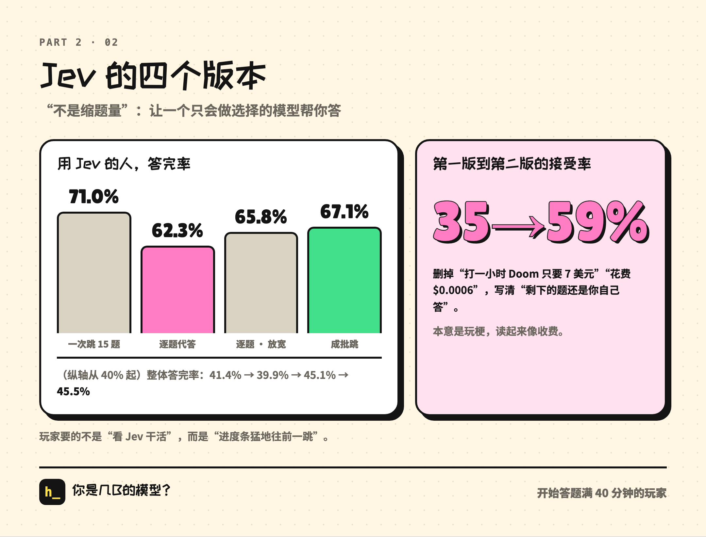
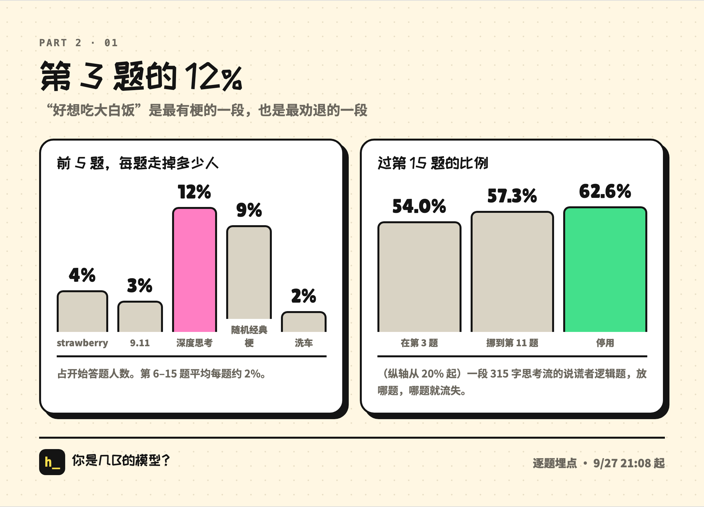
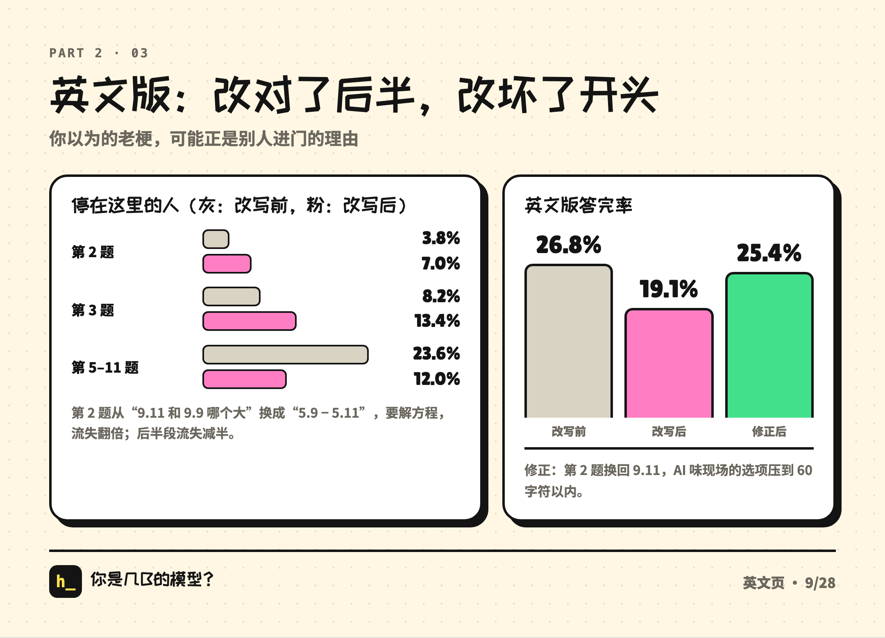
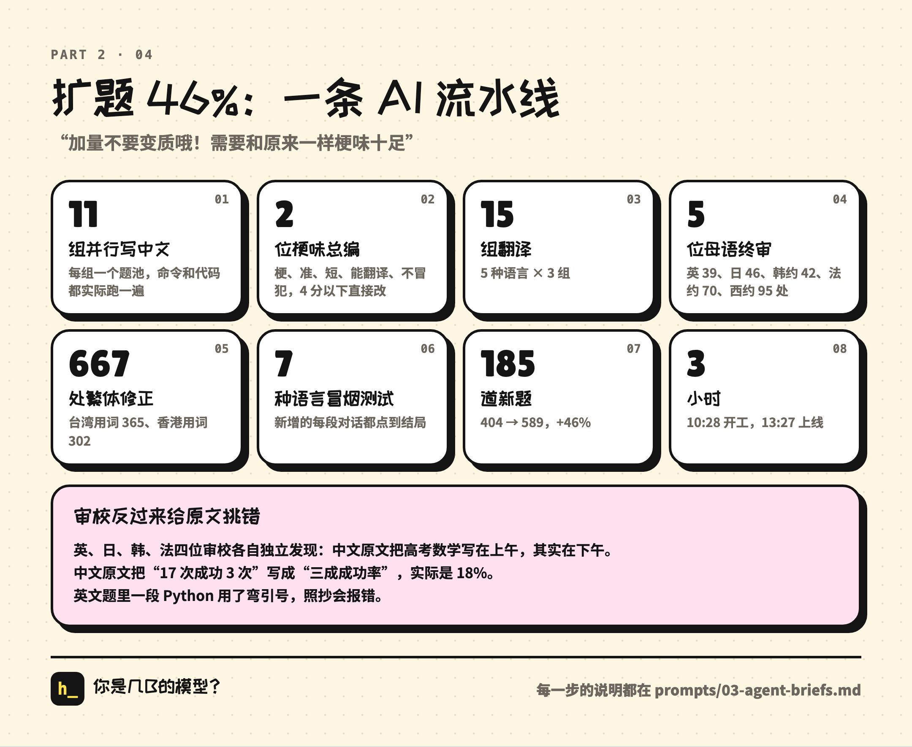

# 「あなたは何Bのモデル？」振り返り（中編）：公開後の36時間と、1問ごとの離脱表

> 全3回の振り返りの2本目です。前編は4通のメッセージから公開まで。今回は公開後、9月27日の午後から28日の深夜まで、私と Claude がデータを見ながらプロダクトをどう直したか。後編は拡散の話と、1.27万件の回答から掘り出したものです。

前編の最後で、私は Claude にこう聞きました。「アクセス解析みたいなのある？ 何人遊んだか見たい」

そこから翌日深夜までの36時間で、Claude Code にさらに約140通のメッセージを送り、本番では大小30か所以上を変えました。ほぼすべてが同じループです。データを見る、原因を推測する、直す、またデータを見る。当たった変更もあれば外れた変更もあり、Claude が2時間前の自分の結論をひっくり返したこともありました。

この記事では、そのうち特に大事だったものを時系列で書いていきます。

> データについて：計測は自前で、匿名です。IP も名前も保存していません（詳しくは後編のプライバシーの節で）。計測は9月27日15:58から始まっていて、公開後最初の1時間のアクセスは記録できていません。「完走率」は回答を始めてから40分以上たった人だけを対象にしていて、時点によって定義が少しずつ違うため、この記事では同じ表の中での前後比較だけをしています。時刻はすべて現地時間です。

---

## 1. 計測：Google アナリティクスは使わない、IP は保存しない

「計測ある？」と聞くと、Claude はまず現状を説明しました。あるのは Cloudflare の管理画面にあるリクエスト総数だけで、誰が本当に遊んだのか、どこまで進んだのかは分からない。そのうえで案を出してきました。

- **Google Analytics は使わない。** 中国国内では読み込めないので、小紅書（RED。中国版インスタのようなSNS）や WeChat から来た人が全部漏れてしまう。
- **小さなデータベースを自前で作る**（Cloudflare D1）。Cookie なし、IP なし、名前なし。ブラウザのローカルにランダムな ID をひとつ置き、「同じ人かどうか」の区別だけに使う。
- **記録するイベント**：訪問（言語、流入元、国）、開始、完走（段階、人格、所要時間）、シェアカードの保存、シェアリンクのクリック、言語の切り替え。後から「何問目まで進んだか」「どの問題で止まったか」、どのアプリから開いたか、書き出しの失敗なども順次追加。
- **集計はターミナルで**：Claude がクエリのスクリプトを書くので、私が「データ見せて」と言えば表が出てくる。

初版はいきなり落とし穴を踏みました。API が先に「受け取りました」と返してからリクエスト本文を読みに行っていたので、その時点ではもう中身が読めず、データが全部消えていたのです。数分後に直りました。

計測を入れて16分後、最初の数字が出ました。訪問者222人、うち67%が開始を押している。30分後には、完走した42人のうち32人がシェアカードを保存するかシェアを押していました。Claude の評価は「診断系のプロダクトは、普通20%あれば上出来です」。

同時に Claude はざっくり計算していました。完走した人1人あたり、約1.6人の友だちが挑戦リンクを開いている。それに3割前後の完走率を掛けると、拡散係数は約0.5。そして、方針を決める一言を言いました。

> 完走率を5割以上に上げられれば、この数字は1に近づきます。

ここから1日半のメインテーマが決まりました。**いちばん効くレバーはシェア率じゃない、完走率だ。**

## 2. Jev：「問題を減らす」は却下した

76問あって、完走までの中央値は18〜20分（トップページには約13分と書いてある）。「長すぎる」という方向で考えるなら、いちばん素直なのは問題数を減らすこと。でも、減らしたくありませんでした。

> 問題数を減らすんじゃなくて、完走に時間がかかって離脱しやすい、そういう人に、ポップアップで「Jevに代打ちさせる」って出す（JEVで検索してみて、これもミームなんだよ）。で問題をいくつか飛ばす（採点にあんまり影響しない問題でいい、進捗を進める、同時にここでJevの速さと出力確率とかなんとかをアピールする）

Jev は2週間前に X でバズったばかりのモデルです。会話はできず、限られた選択肢の中から選ぶことしかできなくて、選択肢ごとに確率を出す。これを「代打ち」にすれば長さの問題を解決できるうえに、それ自体がネタになります。

Claude は Jev について調べ、10分後に初版を公開しました。18、36、54問目の時点で所要時間がしきい値を超えていたら「Jevに代打ちさせる？」とポップアップ。Jev が代わりに答えるのは講評問題や人格チャットのような、スコアへの影響が小さい問題だけ。画面には黒地に緑の文字で意思決定ログが流れ、最後に「代打ち N問 · 0.xx秒 · コスト $0.000x · 説明：なし（Jevは説明しない）」と出ます。

私はもう一言付け足しました。「問題数が減るんじゃなくて、進捗が速くなる」。そこで総問題数は76で固定し、Jev が答えた問題は「完了」扱いに。プログレスバーは 18/76 から一気に 30/76 に跳びます。

**初版の数字はひどいものでした。ポップアップ23回に対して、受け入れたのは8人だけ。**

しばらくポップアップをにらんでから、3通続けて送りました。

> JEVの代打ちのとこ文言分かりにくいんじゃない？ JEVが一部の問題を答えるってことで 全部じゃない

> あーもしかして値段が出てるから課金だと思われてる？ ここ文言直さないと

> コストのとこもそう

ポップアップには「Doom を1時間プレイしてたった7ドル」「コスト $0.0006」と書いてありました。Jev のネタのつもりが、読むとお金を取られそうに見える。第2版では値段を全部消し、タイトルを「Jevに15問だけ答えてもらう？」に変え、太字で「残りの問題はあなたが答えます」の1行を追加、ポップアップのタイミングも12問目に前倒ししました。あわせて、リロードしても進捗が消えないようにしています。

直したあとの結果は、ポップアップ339回、受け入れ201回で、**受け入れ率は35%から59%に**。完走率は29%から40%へ。（これらは一緒に公開したので、それぞれの寄与は切り分けられません。）

その後「こっそり小さいポーションの瓶を置く」入口も考えましたが、2分後に自分で撤回しました。「やっぱ自動ポップアップはあったほうがいいかw」。ポーション瓶は、上部バーの小さな Jev アイコンに置き換えました。後のデータでも、静かな入口だけでは足りないことが分かっています。最初の3問のうちに自分から Jev を開いた人は3〜4%しかいませんでした。

### Jev の第3版：一度の後退

夜9時過ぎ、Jev のデータはとても良好でした。受け入れた人の完走率は67%。ただ、28%の人は5問目より前に離脱していて、そもそも招待まで届いていない。そこで新しいモードを提案しました。1問目から上部バーに「Jevと一緒に解く」を置いておき、オンにすると、代わりに答えられる問題はふつうに表示しつつ Jev が選ぶ。画面に出力ボックス（「Q13 読解 · 32 tokens → B p=0.83 · 6ms」）が出て、約1.5秒後に次の問題へ進む。

このモードは見栄えがいい。Jev のネタが表に出てきます。このモードを公開して1時間のデータもきれいでした。オンにした人の完走率63%、オンにしなかった人は23%だけ。

でも深夜の振り返りで、Claude がプレイヤーを開始時刻でいくつかのグループに分けて比べてみると、こうでした。

| 開始時刻 | Jev を使った人の完走率 | Jev を使わなかった人 |
|---|---|---|
| 20〜21時（旧版：一気に15問スキップ） | 70.5% | 約27% |
| 22時（一緒に解く：1問ずつ代理回答） | **59.3%** | 25.3% |

Jev を使わない人はほぼ変わらず、使った人は11ポイント下がっている。問題は新モードそのものにありました。さっきの「63%対23%」には自己選択バイアスがあります。「オンにしなかった」人の中には、最初の数問で離脱した人が含まれているからです。

Claude の見立てはこうでした。旧版はプログレスバーが一気に大きく進むので、「もうすぐ終わる」という強い動機づけになる。1問ずつの代理回答はその気持ちよさを細切れにしてしまい、しかも毎問1.5秒のアニメーションを見せられる。私はこう言いました。

> Jevの代理回答をオンにしたら、ドカンと一気に飛ばすべきだと思う 何問かまとめて飛ばす、毎回何問かずつ（でも早送りアニメーションで） じゃないとプレイヤーが続かない テンポどうするか見てみて まず相談させて

今回は、先に相談してから手を動かしました。Claude は文字列で4パターンのテンポをシミュレートして（たとえば `[8]·····[4]·····`）、代わりに答えられる問題を早々に使い切って最後に難問が14問残る案や、1回に1問しか飛ばない場面が出る案があることを見つけました。そのうえで本番データからパラメータを決めました。52%の人が12問目の自動招待でオンにしている。45問目まで来た人は9割が完走する。

最終案は、オンにした瞬間にこの先18問の中から最大10問をスキップ。その後は自分で4問答えるたびにまとめてスキップ、1回3〜5問。早送りアニメーションは1問0.25秒、1回最大2.5秒。スキップ後に「Jevが10問スキップ · 約3分短縮」と表示。

| バージョン | 全体の完走率 | Jev を使った人の完走率 |
|---|---|---|
| 旧版：一気に15問スキップ | 41.4% | 71.0% |
| 一緒に解く：1問ずつ代理回答 | 39.9% | 62.3% |
| 1問ずつ代理回答、上限を緩和 | 45.1% | 65.8% |
| **まとめてスキップ** | **45.5%** | **67.1%** |

翌朝、スタート時のジャンプを最大15問に増やして、旧版と同じ勢いにしました。翌日の昼までに、プレイヤーの39%が Jev をオンにしています。

**プレイヤーが欲しかったのは「Jev が働くのを眺めること」ではなく、「プログレスバーがドンと進むこと」でした。**

## 3. 3問目の12%

公開から2時間、Claude は23%の人が5問目までたどり着けていないのを見て、序盤が難しすぎるのではと疑いました。2問目がいきなり ARC のパターン当て（マス目の問題）だったのです。Claude は出題順を入れ替える案を出しました。最初の5問を strawberry、9.11、**深い思考モードの会話**、ランダムな定番ネタ1問、洗車にして、ARC は後ろへ。私も同意しました。

ここでいう「深い思考モード」は、公開前夜に作った「白いご飯食べたい」という名場面です。推理問題の途中で、思考ログに「あ、ちょっとお腹すいた」と出てくる。名場面の中でもいちばんネタが濃い一本なので、「いちばん面白いものを最初に」という方針で3問目に置きました。

4時間後、最初の5問に1問ごとの計測が入り、データが出ました。

| 止まった位置 | 問題 | 開始した人に占める割合 |
|---|---|---|
| 1問目 | strawberry | 4% |
| 2問目 | 9.11 vs 9.9 | 3% |
| **3問目** | **深い思考モード** | **12%** |
| 4問目 | ランダムな定番ネタ | 9% |
| 5問目 | 洗車 | 2% |

6〜15問目では平均して1問あたり約2%が離脱していて、3問目はその6倍。「4問目で止まった」人は、実際には3問目の会話を終えてから去っているので、2問あわせた21%はほぼこの会話のせいだと見ていいでしょう。

原因はすぐに分かりました。この会話の冒頭は嘘つきの論理パズルで、「甲は『乙は嘘をついている』と言い、乙は『丙は嘘をついている』と言い、丙は『甲も乙も嘘をついている』と言った……」。ノードが5つ、思考ログが315字と、全会話の中で最長の一本です。これを3問目に置くのは、始まってすぐに論理パズルを解かせるのと同じでした。

1回目の修正では、タップ1回で終わる「AIっぽさ選手権」に差し替えて、深い思考モードは11問目へ。3問目の離脱は11.7%から3.8%に下がりました（サンプルが増えたあとは3.2%）。でも15問目を超えた割合は2ポイントしか増えなかった。離脱がこの会話と一緒に11問目へ引っ越しただけだったのです。

コメント欄を見ていても、それは分かりました。

> あーQ11の問題がよくないのかも けっこう文句言われてる 別の問題に変えようか

そこで使用停止。11問目は「1ドルで車を買う」「AI売店」「オペレーターにつないで」の3つの短い会話からランダムに出すようにしました。

| グループ | 3問目で離脱 | 5問目を通過 | 15問目を通過 |
|---|---|---|---|
| 深い思考が3問目 | 11.7% | 71.8% | 54.0% |
| 11問目に移動 | 3.2% | 83.6% | 57.3% |
| **使用停止** | **1.3%** | **85.1%** | **62.6%** |

15問目の通過は差し引き8.6ポイント増えました。当時は1時間に1,500人が回答を始めていたので、1時間あたり130人多く15問目を越えた計算です。

この記事を書いていて初めて気づいたことがあります。あの日の深夜2時、ひと山越えたところで、Claude に「へへ ちょっと余韻に浸りたい ほめて」と送りました。（はい、こういうのに弱いんです。）Claude は長々とほめてくれて、その中にこんな一文がありました。「深い思考の問題はあなた自身が3問目に置いたのに、データで離脱の原因だと分かると即座に差し替えましたね」。記録を見返すと、3問目に置いたのは Claude 自身の提案で、私は同意しただけでした。AIは手柄を人間のほうに付けてしまう。これはこれで面白い話です。

## 4. 1問ごとの離脱表

3問目の件で、最初の5問だけ見ていてもダメだと気づきました。

> 1問ごとの離脱表ってないの？ うちらの目標はバズって広がることなんだから へへ

Claude は「離脱」イベントを追加しました。回答中に別のアプリに切り替えたりページを閉じたりしたとき、何問目の、どの問題で止まったかを記録する。1時間後、76問すべての離脱表の第1版が出ました。この表は、その後いちばんよく見るものになります。

- 16問目の時点で残っているのは61%、そこから最後までは14ポイントしか減らず、30問目以降は1問あたりの離脱が0.5%未満。**離脱はほぼすべて最初の16問に集中していた。**
- 離脱が多かったのは、16問目（2本目の名場面）、10問目（ARC のパターン当て。そのうち1問だけで11人が離脱）、4問目、6問目、14問目（Dense 診断）。

そして原因がひとつ見つかりました。プログラムは ARC を、プレイヤーの今の実力より1段難しく出していた。最初の9問の出来が良い人は、10問目でボス級の ARC にぶつかってしまう。7問目と9問目でも、上手い人にはボス級の常識問題が出ていました。そこで、20問目までは全問題を最大で第3段階まで（ボスは第4段階）に制限しました。

| | 6〜15問目の合計離脱 | 15問目を通過 | 完走率 |
|---|---|---|---|
| 制限前 | 21.8% | 64.1% | 45.3% |
| 制限後 | 18.7% | 66.0% | 45.3% |

中盤の離脱は3ポイント減ったのに、**完走率はまったく変わらなかった**。一部の人は、やめるタイミングを後ろにずらしただけだったのです。失敗とまでは言えませんが、中間指標が良くなっても最終指標が良くなるとは限らない、と思い知らされました。数時間後、この教訓はもう一度、もっと痛い形でやってきます。

同じ表から、「1ドルで車を買う」を11問目に置くと離脱が他の2本の2倍になることも分かったので、11問目は「AI売店」と「オペレーターにつないで」の2本からだけ出すようにしました。

## 5. 人格：実際のプレイヤーで較正し直す

公開から1時間半、完走した512人のうち GPT-5型が34%、Grok型が28%、GPT-4o型が22%で、上位3つで84%を占めていました。

原因は、人格の基準線を「ランダムに選ぶ」シミュレーションで作っていたこと。実際のプレイヤーはネタ選択肢が大好きなので、みんな Grok と 4o に寄ってしまうのです。Claude はまず完走イベントに人格の生の特徴量を追加し（数字25個だけで、選択肢の本文は保存しない）、1,747件の回答がたまったところで基準線を計算し直しました。

較正後、上位3つの合計は51%まで下がり、8種類の人格は17%から6%の範囲に収まりました。最多は 4o と GPT-5、最少は Kimi。前編で私が言った「正直に、でも分布は極端にならないように」が、ここでようやく実データで形になりました。

## 6. 繁体字：「抜き打ちチェックって雑じゃない？」

夕方、Claude に「フランス語とか、もう何言語か増やす？」と聞きました。Claude はデータを出して反対しました。フランスからの訪問者は合計10人、スペイン語版は公開以来7人しか開いていない。**本当に足りないのは繁体字**だ、と。香港と台湾を合わせて訪問者625人、全体の17%で、韓国より6倍も多い。この人たちは簡体字版を見るしかなく、100人以上は英語版に振り分けられていました。

私は「今すぐやって 繁体字とフランス語」と返しました。

フランス語の結果は Claude の予想どおりで、深夜0時の時点で訪問者31人、完走9人。幸いコストはとても低く、メインの作業時間はほとんど取られませんでした。

繁体字の計画は、まず OpenCC で簡体字から繁体字に自動変換して、そのあと抜き打ちでチェックするというもの。私は割り込みました。

> 抜き打ちチェックってちょっと雑じゃない？

さらに2通。

> でも繁体字って 香港だと言い方違くない？

> 言い方も違うでしょ 軟件とか軟體とか

そこで、校正担当を14人立てて、台湾の言い回し・香港の言い回しでそれぞれ1周ずつ、1文ずつ突き合わせる方式に変えました。見つかった問題は600か所以上。

- テストに「通過」した（＝合格した）という表現が自動で「透過」に変換され、意味がまるで逆に。問題バンクの1セクションだけで9か所
- 「質量」は台湾では物理の質量のことなので、クオリティの意味なら「品質」と書く
- 大陸の言い方を現地の言い方に。トマトは「西紅柿」ではなく「番茄」、コアラは台湾では「無尾熊」、香港では「樹熊」
- **ビルドのバグも見つかった**：変換スクリプトが結末の説明文の一部をモデル名だと誤認して保護していたため、290件の結末説明が繁体字版でずっと簡体字のままだった

繁体字版の入口は「繁體」ひとつだけで、訪問者のいる地域に合わせて言い回しを自動で切り替えます。ソフトウェアは軟件か軟體か、タクシーは的士か計程車か。

深夜0時の時点で、繁体字ページの訪問者は742人、完走率は47%。簡体字ページの42%より高くなりました。

## 7. 英語版：後半は直せたのに、冒頭を壊した

翌日の午前、各言語の完走率は40〜60%だったのに、英語だけが18〜23%でした。英語ページは開始率も最低で57.5%、中国語は74%、韓国語は82%です。

> いいと思う 英語圏向けに特別対応してみよう たぶんもっと気が短い

> ミームとか言語環境も関係あるかも 見てみて

Claude はまず「アメリカのユーザーは遊ばない」説を消しました。アメリカの IP 全体の完走率は41%あって、英語ページだけが低い。しかも英語の離脱はまんべんなく、最初の6問で1問あたり4〜7%ずつ減っていて、特定の1問が壊れているわけではない。結論は、コンテンツの問題でした。

仮説は4つ立てました。序盤が英語圏のAI界隈ではとっくに擦られ尽くした2024年の古いネタ（strawberry、9.11）ばかり。常識問題が古いネット雑学（トマトはベリー、金魚の記憶は7秒）。英語は中国語よりずっと長く、スマホで読むと疲れる。翻訳調で、笑いどころが翻訳で失われている。

そこで「英語編集者」を2チーム立てて、英語圏のAI界隈の好みに合わせて書き直しました。序盤を2025年の新しいネタに（GPT-5 リリース週の「blueberry に b はいくつ？」、「5.9 = x + 5.11」）。常識問題41問のうち27問を差し替え。『三体』を『デューン』に。40行の英語スタイルガイドも書きました。

書き直し後、最初にデータを見たときの結果は微妙なものでした。

| 止まった位置 | 書き直し前 | 書き直し後 | この問題 |
|---|---|---|---|
| 2問目 | 3.8% | **7.0%** | 9.11 vs 9.9 → 5.9 − 5.11 |
| 3問目 | 8.2% | 13.4% | AIっぽさ選手権 |
| 5〜11問目の合計 | 23.6% | **12.0%** | |

中盤以降の離脱はほぼ半減したのに、序盤でより多く落ちるようになって、全体の完走率は26%から20%に下がってしまいました。2問目の離脱は倍増。方程式を解くのは、ひと目で大小を比べるよりずっと頭を使うからです。

修正として、2問目を 9.11 に戻し、AIっぽさ選手権22問の選択肢をすべて60文字以内に詰めました。夜には完走率が25.4%に戻り、書き直し前の26.8%に近づきました。

教訓は2つ。ひとつは、**自分が古いと思っているネタこそ、ほかの人にとっては入ってくるきっかけかもしれない**ということ。strawberry と 9.11 は英語圏で確かに擦られ尽くしていますが、誰でも知っているからこそ入口に置くのに向いている。もうひとつは、**1問ごとの表の価値は、「全体が悪くなった」を「どの問題が良くなって、どの問題が悪くなったか」に分解できること**。合計だけ見ていたら「書き直しは失敗」と結論して、後半の良くなった部分まで一緒に捨てていたはずです。

## 8. 「ABテストはいらない、AA指標だけ見る」、そして Claude の自己訂正

翌日の昼、Claude に「流入チャネル × 離脱」の表を出してもらいました。

| どこから開いたか | 12問目を通過 | 完走 | Jev を使った人の完走 | Jev を使わなかった人の完走 |
|---|---|---|---|---|
| 通常のブラウザ | 73% | 48% | 66% | 40% |
| QQ | 68% | 42% | 73% | 32% |
| WeChat | 62% | 37% | 65% | 27% |
| X | 57% | 30% | 58% | 20% |

X から来た人は、12問目（Jev の最初の招待が出る位置）の時点ですでに43%が離脱していて、ほとんどが招待までたどり着いていません。Claude は A/B テストを提案しましたが、私はこう決めました。

> 1. この何種類かのプレイヤーには4問目でJevの招待を出す……Xのアプリ内ブラウザで開いた人、WeChatのアプリ内ブラウザで開いた人、Xのリンクから来た人、英語版の全員。2. それ以外は12問目のまま。これでいこう この方針で ABはいらない AA指標だけ見ればいい

（ここでいう AA 指標は全体の指標のことで、AA知能指数ではありません。）

この変更を公開してから2時間のあいだに、Claude は2回報告してきました。招待を前倒ししたチャネルでは15問目の通過が約4ポイント増えていて、「中盤の定着が改善しています」。

さらに1時間ちょっとたって、Claude は自分でそれをひっくり返しました。

> 先ほど「中盤でより多くの人が残っている」と言いましたが、これは成り立ちません。Jev をオンにすると最大15問を一気にスキップするので、スキップされた問題も「到達」としてカウントされます……唯一信頼できる指標は完走率です。対照群の自然な変動を差し引くと、前倒し後の完走率はむしろ約2ポイント下がっています。

Jev を使う人は確かに26%から49%に増え、15問目の通過も60%から67%に上がりました。でもそれは Jev のスキップで「飛ばされた」結果で、人が本当に残ったわけではない。完走率は37.6%から36.8%になり、同じ期間に対照群は46.0%から47.2%に上がっていました。

私の返事は「了解 戻していいと思う」。全チャネルを12問目の招待に戻しました。

これはプロジェクト全体で唯一、AIが自分からデータの読み違いを認めて、変更の取り消しを提案したケースです。振り返ると、「A/B をやらない」ことでスピードは手に入ったけれど、その代わりに対照チャネルで時間帯の影響を差し引くしかなく、あやうく指標の定義にだまされるところでした。

## 9. 問題バンクを46%増量：AIのパイプライン

翌朝、Claude は完走したプレイヤーの11%が2回以上遊んでいることに気づき、「問題かぶり」の確率を計算しました。友だち同士で、人格チャットがかぶる確率が50%、名場面の会話が40%、AIっぽさ選手権が33%。**シェアカードでいちばん目立つ中身が、よりによって問題バンクがいちばん小さい3カテゴリから来ていたのです。**

最初の2ラウンドで、まずこの3カテゴリを倍にしました。朝10時、私はさらに言いました。

> 増やそう！ 問題バンクは最低45%は増やしたほうがいいと思う どう思う？

> 量を増やしても質は落とさないでね！ 元と同じくらいネタ感たっぷりで

Claude は「1回に何問出るか ÷ バンクに何問あるか」で優先順位をつけました。いちばんかぶりやすいのはグラフ問題（1回4問出るのにバンクに9問しかない）とパソコン操作問題。目標は約404問から589問へ、185問追加、つまり46%です。そしてパイプラインを組みました。

1. 共通の執筆ガイドと、セルフチェック用のスクリプトを書く
2. **11組のサブタスクが並列で中国語の問題を書く**。各組がひとつの問題プールを担当し、コマンド、正規表現、コードはすべて実際に動かして確かめる
3. **「ネタ編集長」2人がレビュー**。各問題の「ネタ度、正確さ、短さ、翻訳しやすさ、人を不快にさせないか」を採点し、4点未満はその場で直すか差し替える
4. 5言語 × 3組、計15組が並列で翻訳
5. 言語ごとに**ネイティブの最終チェック**担当が1人、最初から最後まで通読
6. 繁体字は2回校正
7. 7言語でスモークテスト。追加した会話はすべて結末までクリックして確認

朝10時半に着手して、午後1時半に公開。各ステップの指示書はオープンソースのリポジトリの `prompts/03-agent-briefs.md` に入っていて、そのまま流用できます。

このパイプラインでいちばん面白かったのは、校正担当が逆に原文の誤りを見つけてきたことです。

- **4か国の校正担当が、それぞれ独立に同じ誤りを見つけた。** 前のラウンドのローカライズで、中国語の原文には高考（中国の大学入試）の数学が「6月7日の午前」とあったのですが、実際はその日の午前は国語で、数学は午後。英・日・韓・仏の4人の校正担当はお互いの結果を見られないのに、全員がこれを指摘しました。そのラウンドで私が気にしていたのは「日本にも高考ってあるの？」くらいで、Claude も最初は原文に問題はないと思っていたのですが、それでも校正担当は立てていました。
- 中国語の原文で「17回中3回成功」を「成功率3割」と書いていたが、実際は18%
- 英語の問題の Python コードにスマートクォートが使われていて、そのままコピーするとエラーになる
- 日本語で1か所、意味が逆に訳されていた。韓国語のある単語は今では差別語とみなされるので差し替えた
- 繁体字で「对象」（交際相手）が台湾向けの変換ルールでプログラミング用語の「物件」（オブジェクト）に変わってしまい、ダジャレがひとつ死んだ
- ライターが「AIがポケモンをプレイしておつきみやまで詰まる」を2回書いてきて、2回とも私がボツにした。「ポケモンのおつきみやま、界隈の外まで届かない気がする」

**翻訳のプロセスが、逆に原文のファクトチェックになっていました。**

一度だけ事故もありました。ある翻訳チームがフルビルドを走らせたせいで、本番の繁体字版が簡体字から自動変換され、まだレビューしていない新問題まで載ってしまったのです。気づいてすぐ校正担当を立てて補いました。

## 10. Safari と四芒星

翌日の午前、8種類の人格それぞれに専用の配色を作りました。豆包型（日本語版では Siri 型）には赤いマフラー、Gemini 型には四芒星の背景、Grok 型にはスラッシュ柄と警告テープ。まず非公開のプレビューにして、私が確認してから公開しました。

2時間後、自分でやってみたら Gemini 型が出て、シェアカードの生成に失敗しました。

> 中国語 1.5Bモデル dense gemini人格で失敗した なんでだろ それともIPと関係ある？

> safari

> 昨日の夜は少なくとも大丈夫だったのに 何があったんだろ

Claude は2分で原因を特定しました。Gemini の四芒星も Grok のスラッシュ柄も、CSS の背景に SVG 画像を埋め込んで作っていた。Safari はこの種の画像を canvas に描くと、その canvas を画像として書き出すことを禁止する。豆包の赤いマフラーはたまたま通常の画像タグで置いていたので無事でした。それまでずっと Chromium でテストしていたので、一度も発生していなかったのです。

配色を公開してから直すまでの2時間、Safari で Gemini 型か Grok 型が出た人は全員、シェアカードを書き出せませんでした。修正は、3つのテクスチャを PNG に置き換え、Safari のエンジンで9種類の配色をすべてテストし、さらに「書き出し失敗」の計測を追加。

この計測がすぐ別の問題も捕まえました。一部の人の環境で、スクショ用ライブラリが公開 CDN から読み込めていなかったのです。自前ドメインから読み込むフォールバックを足したところ、書き出し失敗はゼロになりました。

## 11. この36時間で学んだこと

**1. まず最大のレバーを見つける。** 20分遊ぶ診断にとって、最大のレバーは完走率です。シェア率はもともと高い（完走した人の半分以上がシェアする）ので、完走する人が増えればシェアは自然に増えます。

**2. 1問ごとの表は、合計よりずっと役に立つ。** 3問目の12%、10問目のボス級 ARC、英語版2問目の倍増。どれも合計だけ見ていたら絶対に見えなかったものです。

**3. 指標の定義は人をだます。しかもごく自然に。** Jev がスキップした問題も「到達」に数えられる。「Jev をオンにした人63%対オンにしなかった人23%」には自己選択バイアスがある。最初の何枚かの表は、タイムゾーンが間違っていた。時点によって完走率のしきい値が違う。どれも、あやうく間違った結論を出すところでした。

**4. 方向は私、測定はAI。** いくつかの重要な決定は、私の一言から来ています。「問題を減らすんじゃない」「抜き打ちチェックって雑じゃない？」「ドカンと一気に飛ばすべき」。いくつかの重要な発見は Claude から来ています。3問目の離脱、フランス語はやる価値がないこと、そして自分の結論をひっくり返したあの訂正。逆もまた然りで、私が決めた「A/B をやらない」はマイナスの変更をあやうく残すところだったし、Claude が「いちばん面白いものを最初に」で3問目に置いた会話は、12%の人を追い返しました。

**5. 効果が見えないものには期待しない。** これは後編で詳しく書きます。公開してもデータがぴくりとも動かなかった機能もあって、それは残しておくけれど、もう時間はかけない。

---

36時間がたって、完走率は開始時の29%前後から、45%前後で安定しました。アクセスは翌日の夜から自然に落ち着き始めました。

でもそれより前から、同時にもうひとつのことが起きていました。プレイヤーがこれを広めていたのです。新規訪問者の4割は友だちの挑戦リンクから来ていて、完走した日本のプレイヤーは1人あたり平均2.3人の新規訪問者を連れてきていた。挑戦リンクから来た人の7割は、リンクを送ってきた友だちに負けていました。

それが後編の話です。

- 遊んでみる：<https://humanbench.ybuild.ai>
- ソースコード、問題バンク、全プロンプト：<https://github.com/alex-ybuild/humanbench>
- 図解つき完全版：<https://humanbench.ybuild.ai/retro/ja/>

—— Alex（@Alex_ybuild）
