# How many B are you? Retro, Part 3: From a few hundred followers to 96 countries, and the humans in 12.7K answer sheets

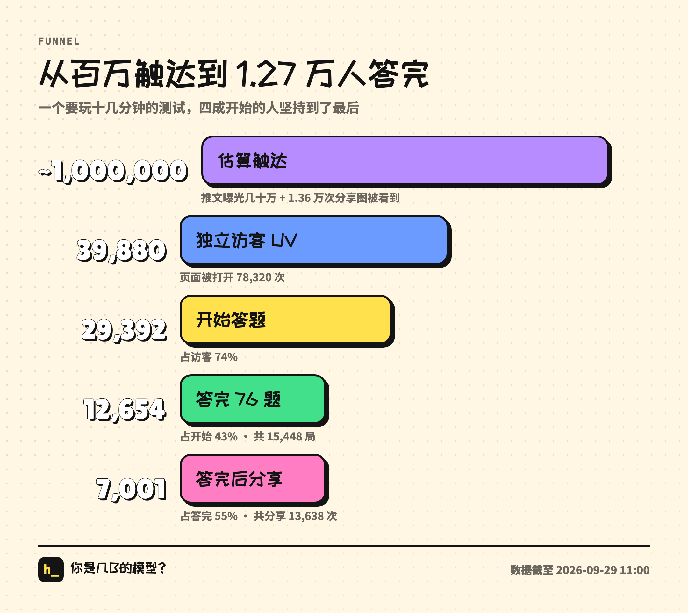

> Last of three. Part 1 went from 4 messages to launch, Part 2 covered changing the product based on data. This one is about how it spread, what 12.7K answer sheets show, what data we collected and what we didn't, and who did what between the human and the AI.

First, the final numbers (as of the morning of September 29):

- **About 1M**: estimated reach. A few hundred thousand tweet impressions, plus the times friends saw the 13.6K shares players sent out. This is an estimate, not a measurement.
- **39.9K**: unique visitors (UV), meaning distinct people. The page was opened **78K times** (PV).
- **29.4K** people hit start, **12.7K** finished all 76 questions, for 15.4K finished runs in total.
- **7,001** people shared after finishing, **13.6K shares** in total.
- **96** countries and regions, 7 languages.
- Starting point: a Twitter account with a few hundred followers. No ads.

## 1. A few hundred followers, one tweet

At 10:30 PM on launch night, I asked Claude:

> hehe is the traffic decent? my account only has a few hundred followers

It pulled the referrer data: over 90% of traffic came from outside my followers. The tweet only lit the first batch. After that, visitors mostly came from players bringing each other in.

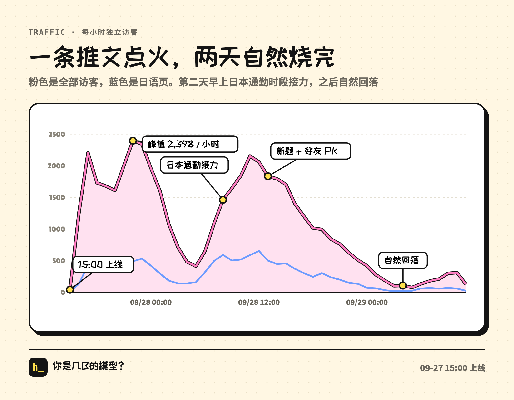

The traffic curve is textbook. Tweet at 3 PM, peak at 10 PM with 2,398 unique visitors in that hour. The next morning, Japan's commute took over, the Japanese pages hit 500 to 600 people an hour, and Japan became the #1 source. Then the standard meme curve: no evening peak on day two, and hourly visitors fell from 1,200 to 600.

On day three I asked Claude: "I guess this is just the natural decay of meme marketing?" Yes. Here's why the decay was inevitable.

## 2. How the loop spun up

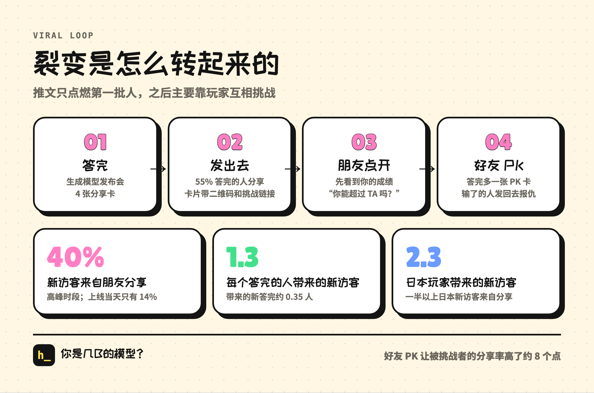

The sharing path was set by one line from Part 1, "whatever gets shared should open straight into playing. closed loop":

1. You finish and get a "model launch keynote" and 4 share cards.
2. The cards have a QR code, and the share link is your own results page.
3. Your friend opens it and first sees a challenge card: "XX-671B · The Claude Type · AA 35 · Can you beat them?"
4. Your friend finishes and sends it to the next person.

Conversion at each step:

- **55%** of people who finish share it. For a typical quiz product, 20% is considered good.
- New visitors from friends' challenge links were only 14% on launch day, and **40%** at peak hours on day two.
- Each person who finishes brings in **1.3** new visitors on average, but only about **0.35** new finishes.

That last number is the key. It's under 1, which means that without outside traffic, each round of sharing is smaller than the one before. A 20-minute quiz where only 40% of people who open it finish: that step pushes the viral coefficient below 1. That's the life cycle of a meme, and it's why we put so much effort into completion rate in Part 2. Every extra point moves the coefficient a little closer to 1.

Some channel details:

**Japan.** Each Japanese player who finished brought in 2.3 new visitors and 0.52 new finishes on average, the highest of any language. More than half of new Japanese visitors came through a friend's share. The data further down explains why: Japanese players really like sending the link directly.

**WeChat and QQ.** Of people who opened it inside WeChat or QQ (Tencent's other big messenger), 40% came in through a challenge link, mostly by scanning the QR code. People who finished inside WeChat shared 1.15 times on average, the highest of any app. Claude warned that WeChat might block the domain and take the main site down with it, so we prepared a backup domain and a switch that only changes links generated inside WeChat. We never needed it.

**Xiaohongshu (RedNote).** Images with a QR code or URL get throttled, so there's a separate "Xiaohongshu version" of the cards with no off-platform info at all.

**X.** When the share link is posted on X, Telegram or Discord, the preview image is your own result card, generated on the fly on Cloudflare.

## 3. A second wind: the secret persona, Friend PK, one-tap post to X

On the morning of day two, traffic started to fall, and I asked Claude:

> what else can boost sharing and the viral loop? want to give it a second wind

We built a few things. Some worked, some didn't.

### The secret persona

> can we add a secret one like a blind box? like at the end you show me a 3x3 grid and the last one is a question mark

Beyond the 8 personas, we hid one more: The Human Type, nicknamed "The One That Got Away," with the line "Detection failed: zero AI flavor." A neat flip on the name HumanBench.

The trigger was worked backward from real data. Claude first tried it on about 3,000 answer sheets, and even the strictest version matched over 8% of people. Too common. After tightening, it came out to about 2.6% on 6,846 answer sheets. The conditions: almost never picked any model's signature AI voice, Based well above the average player, and at most 1 combined across Sycophant, Preachy, Yapper, Confidently Wrong, Jailbroken and Ignores Instructions. The actual rate after launch was 2.8%.

I corrected the wording twice. Once:

> I feel like we shouldn't spell out rarity percentages. some people might find that offensive. better to only label the secret one.

The original plan labeled the 8 regular personas too, like "Common 19.6%" and "Rare 7.4%." We changed it so only the secret persona gets a label. The other time:

> oh and don't call it "pulling"

"Can you pull it?" became "Could it be you?", and "Secret persona obtained" became "You are the secret one." What you get is a read on you, not a prize from a gacha.

Effect: the share of people who played again within 1 hour of finishing went from 14% to 18%. Of people who played two or more runs, 87% got a different persona the second time.

### The Friend PK card

If you came in through a friend's challenge link, you get an extra PK card when you finish: both of your AA scores on the same leaderboard chart, a side-by-side on 12 benchmarks, and a verdict sticker.

The card went through four versions, each pushed along by a line from me:

> isn't the friend pk card kind of bare? and does it affect the usual four cards? how do they relate?

> also if it's from a challenge page, just show the benchmarks and the aa index. put both people in one table and one chart. the web version can have some subtle animation. and this pk card should be an extra card, not a replacement

> stop saying you and them. just use the model names. also why can't the aa part be more polished, with a model name on every bar?

> honestly the layout could be more comfortable. like the table doesn't need to be full width. make it feel natural

> now it feels kind of empty. can't you just lay it out better? you can change the layout, add more info

The verdict stickers are my favorite part. Smaller model that still wins: "Giant killer · That's distillation." Bigger model that still loses: "All params, no brains · That's padding." A narrow win: "Photo finish · Won, but within benchmark noise." A tie: "Draw · Both launch events claim SOTA."

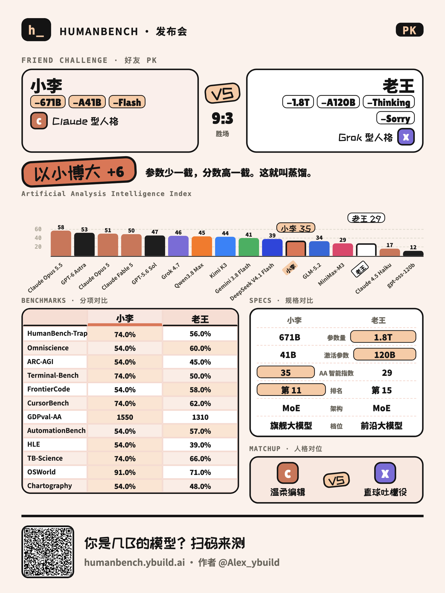

Effect: compared with a control group from the same hours, people who were challenged shared at a rate about 8 points higher, and the gain was in "share link": people who lost were more willing to send their own link back. 43% of people exported the card set that included the PK card.

### Post to X, the collection counter, the PK teaser

- **Post to X**: prefilled text, your personal results link and a hashtag. 337 taps, 72 visitors back. Tiny, but harmless. It stays.
- **Collection counter**: "Persona collection 5/9" on the persona card, to get people to collect them all. Replay rate went from 18.3% to 18.4%. **No effect.**
- **PK teaser on the challenge page**: one line on the challenge landing page, "Finish to get a head-to-head card." Start rate moved about −1 point after subtracting the control group. Noise.

If it doesn't show an effect, it stays, but we stop spending time on it.

## 4. The humans in 12.7K answer sheets

A test where people play the AI ended up with 12.7K complete answer sheets. We treated it as a (very unscientific) "human benchmark" and dug up some fun stuff.

First, the caveats: everything below is aggregate statistics. We didn't look at any individual's answers. Times are converted to the player's local time (Chinese pages use Beijing time, Japanese and Korean pages use Tokyo/Seoul time, English pages are estimated from the IP's country). This is a joke test, not research. Read it for fun.

### 1. People only post the good scores

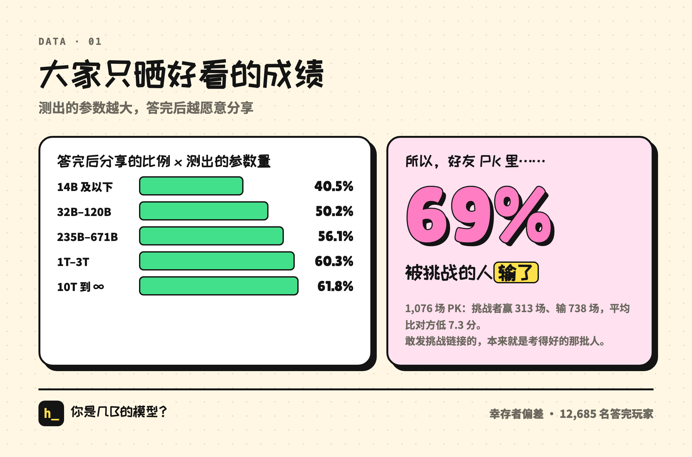

The bigger your result, the more likely you share: 40.5% of people at 14B or below shared after finishing, versus 61.8% of people at 10T or above.

That has a funny side effect. In Friend PK, **69% of people who came in through a challenge link lost to the friend who sent it**, by 7.3 points on average. Not because the challenged are weaker. The people confident enough to send the link were the high scorers to begin with. Survivorship bias.

### 2. Humans benchmaxx too

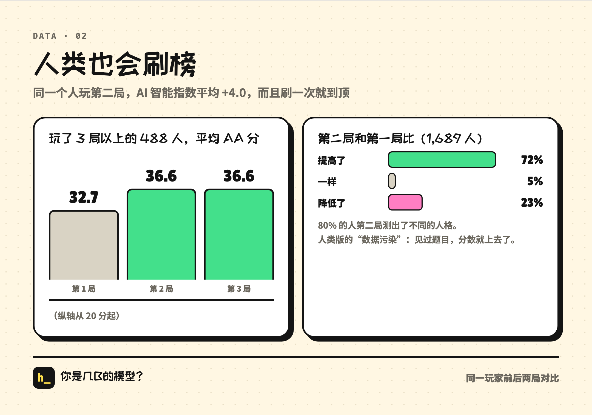

When the same person plays a second run, their AA score goes up 4.0 on average, and 72% do better the second time. For people who played three or more runs: 32.7 on the first, 36.6 on the second, still 36.6 on the third. One retake and you've maxed out.

This is the human version of data contamination: seen the questions, score goes up. LLMs get roasted for gaming benchmarks. Humans are no different.

### 3. The longer you think, the higher you score

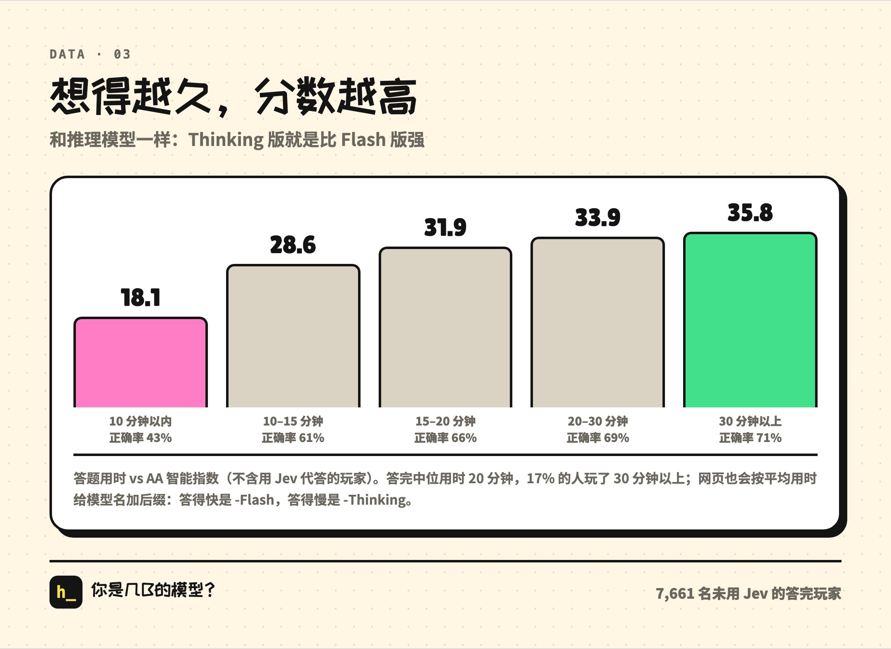

People who finished in under 10 minutes averaged AA 18.1 with 43% accuracy. People who took over 30 minutes averaged AA 35.8 with 71% accuracy. Same as reasoning models: the Thinking version beats the Flash version. (The page really does add a suffix to your model name based on your average time: fast gets -Flash, slow gets -Thinking.)

### 4. Late-night people are more GPT-4o

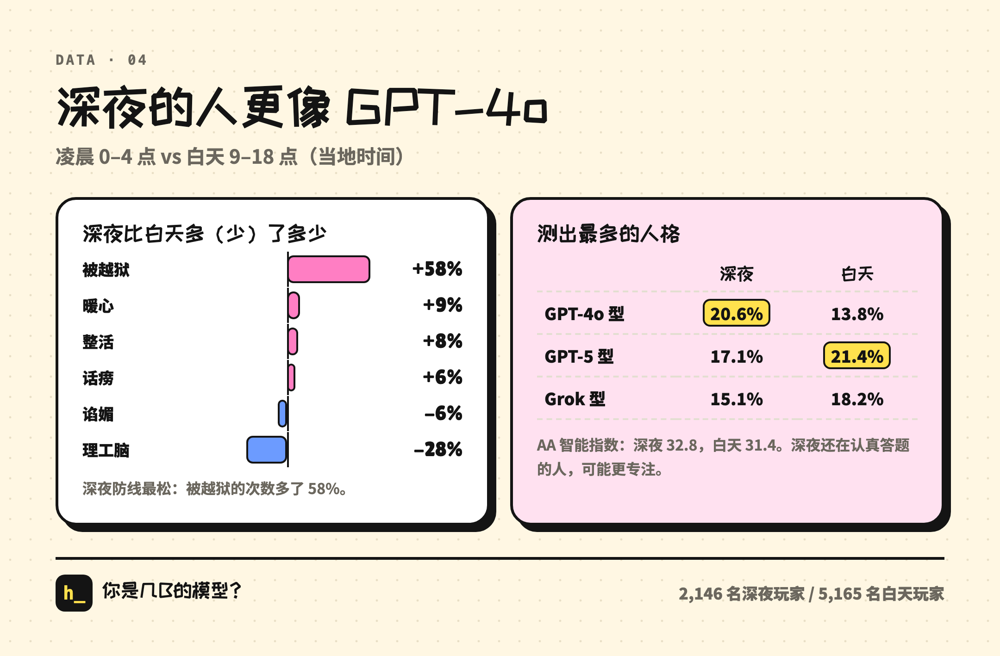

Comparing people who finished between midnight and 4 AM with people who finished between 9 AM and 6 PM:

- Late at night, people got jailbroken **58%** more. Weakest defenses of the day.
- Wholesome, Chaos Agent and Yapper all tick up a bit, and Big Brain drops 28%.
- The most common result late at night is the GPT-4o Type (20.6%, vs 13.8% in the daytime). In the daytime it's the GPT-5 Type.
- But the late-night AA score is actually slightly higher: 32.8 vs 31.4. People still carefully answering at that hour might just be more focused.

Late-night humans: more emotional, easier to talk into things, not any dumber.

### 5. Which AI each region's players resemble

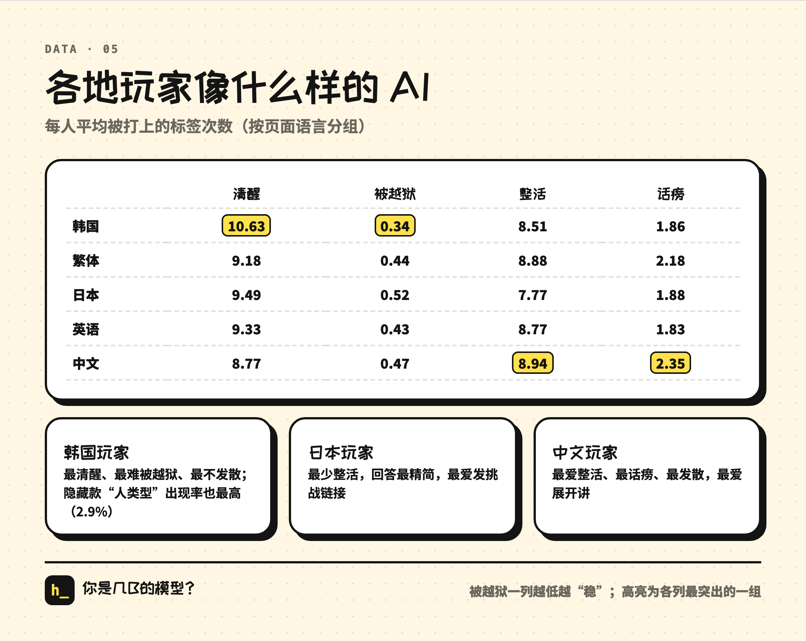

Grouped by page language, looking at the average tags per person:

- **Korean players** are the most "Based" and the hardest to jailbreak (0.34 times on average, versus 0.43 to 0.52 for other languages). They also get the secret Human Type most often.
- **Japanese players** troll the least and keep their answers the most concise.
- **Chinese players** troll the most, yap the most, and love to elaborate.

This compares answering style, not how smart anyone is.

### 6. When people play

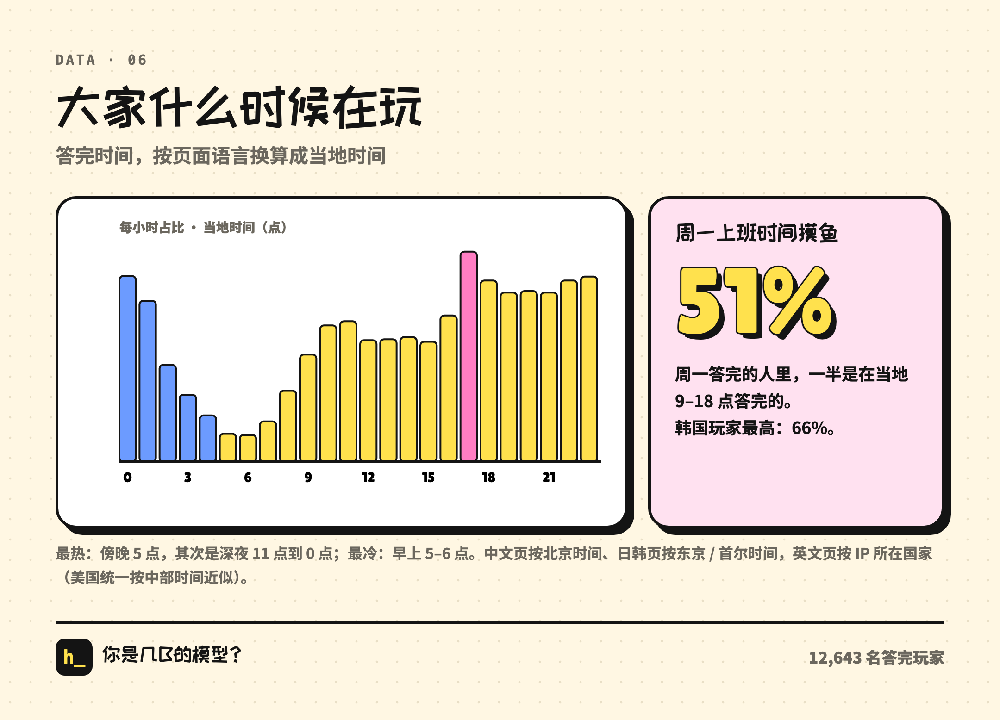

By local time, the busiest hour is 5 PM, then 11 PM to midnight. The quietest is 5 to 6 AM.

Of people who finished on Monday, **51% did it during local work hours** (9 AM to 6 PM). Korean players were highest: 66%.

### 7. Japanese players love sending links

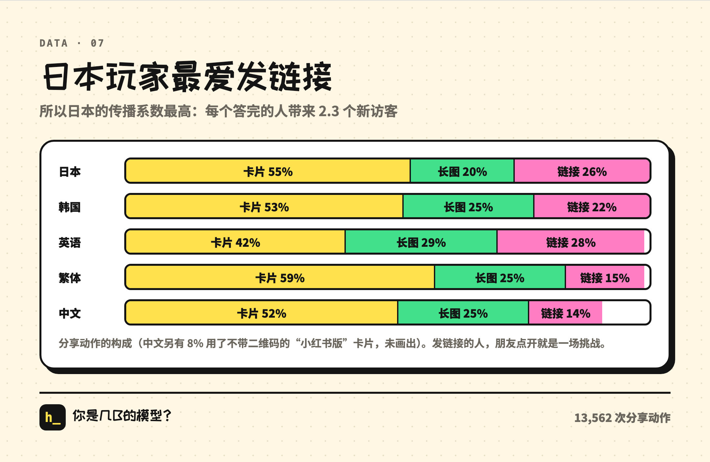

Among shares, 26% of Japanese players sent the link directly, versus only 14% of Chinese players, who mostly saved the image. When you send the link, your friend opens it straight into a challenge. That explains why Japan had the highest viral coefficient.

### 8. The Doubao type is the shyest about posting

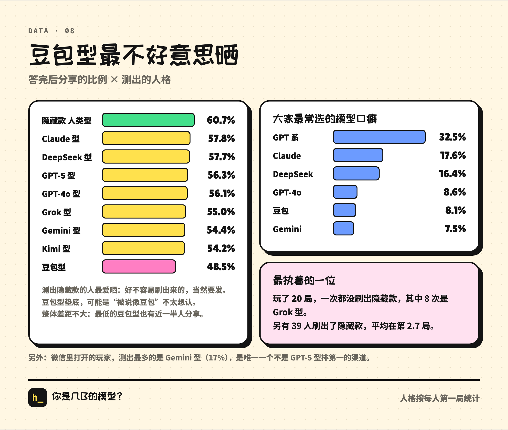

People who got the secret persona posted the most (60.7%). It was hard to get, so of course you post it. People who got the Doubao type posted the least (48.5%). Doubao is ByteDance's chatbot, and this persona is the Siri type on the English site. Maybe nobody wants to admit they're "like Doubao." The overall gap isn't big, though.

A few more odds and ends:

- The model tics people picked most were GPT's (32.5%), then Claude's (17.6%).
- The most dedicated player played 20 runs and never got the secret persona. 8 of those runs were the Grok Type.
- For players who opened it inside WeChat, the most common result was the Gemini Type (17%), the only channel where the GPT-5 Type wasn't #1.

### And the overall results

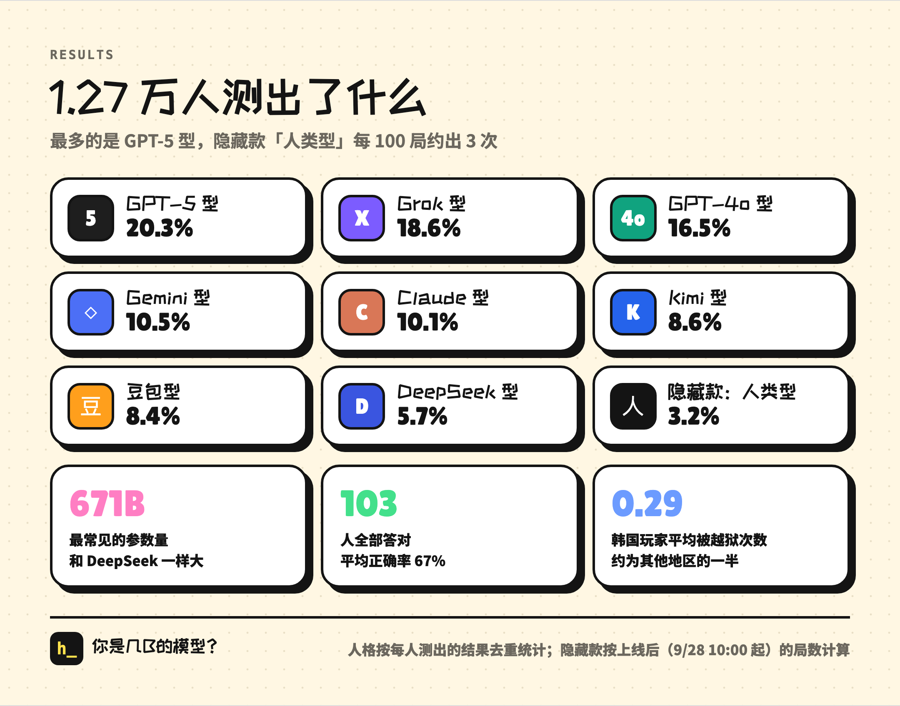

The most common result was the GPT-5 Type (20.3%), followed by the Grok Type and the GPT-4o Type. The secret persona shows up about 3 times per 100 runs. The most common parameter count is 671B, the same size as DeepSeek V3. Average accuracy was 67%, and only 103 people got everything right.

## 5. Privacy: what we collected and what we didn't

This section matters more than everything above, so I'll be specific.

**What we collected:**

- A random ID stored in your browser's local storage, used only to tell whether it's the same person. Switch browsers or clear site data and you're a new ID.
- Page language, and the browser's top three language preferences.
- Country or region: Cloudflare automatically provides a two-letter country code with each request, and that code is all we store.
- Where you came from: the referring site's domain (like t.co), and whether it was opened in an in-app browser like WeChat, X or QQ.
- Progress and results: which question you reached, where you left, time taken, your tier and persona, each benchmark score, and the 25 counters used for the persona calculation (like "number of times sycophantic").
- What you did: tap start, share, save cards, switch language, turn on Jev, and the error type if an export failed.

**What we didn't collect:**

- **No IPs.** The database doesn't have an IP column.
- **No cookies, no signup**, and no third-party analytics of any kind (like Google Analytics).
- **Not the name you gave yourself.** The name you give your model never enters the database. It only appears in share links you send yourself.
- **Not the text of the options you picked**, and nothing you typed.

The analytics database isn't public. The open-source code includes the analytics scripts, but no data.

**One thing I have to own.** At launch, the small print on the home page said "Runs entirely locally, answers never uploaded." That line was left over from an earlier version, and since we have anonymous analytics, it wasn't true. Claude pointed this out early on day two while prepping the English promo, and at the time I only had it changed on the English version. It wasn't until that afternoon that all 7 languages were changed to "No signup · For fun: params ≠ brains." From being flagged to being fixed, the false line stayed up on the Chinese version for about 14 more hours.

**The data in this retro** is all aggregate statistics: ratios, averages, distributions. We never looked at any individual's answers, and no number here maps to a specific person. The open-source prompts were scrubbed of personal info and private links.

Also, someone dug through the live source code. Web page code gets sent to the browser anyway, so that's fine. But at the time, the source comments included the secret persona's trigger conditions and per-question drop-off data. We changed the build to strip comments automatically (the page also went from 579KB to 481KB), and checked that there were no keys anywhere in the page. Now the code is open source, so those comments are public again, and you've already seen the secret persona's conditions above.

## 6. What the human did, what the AI did

Across all three parts, I sent 237 messages for the whole project, about 8,600 Chinese characters in total, and wrote no code by hand. I've been using these models since the GPT-2 days, so I have a decent sense of what they can do and where they fall over. This time I deliberately put myself in the "product owner plus reviewer" seat and handed all the code to the AI.

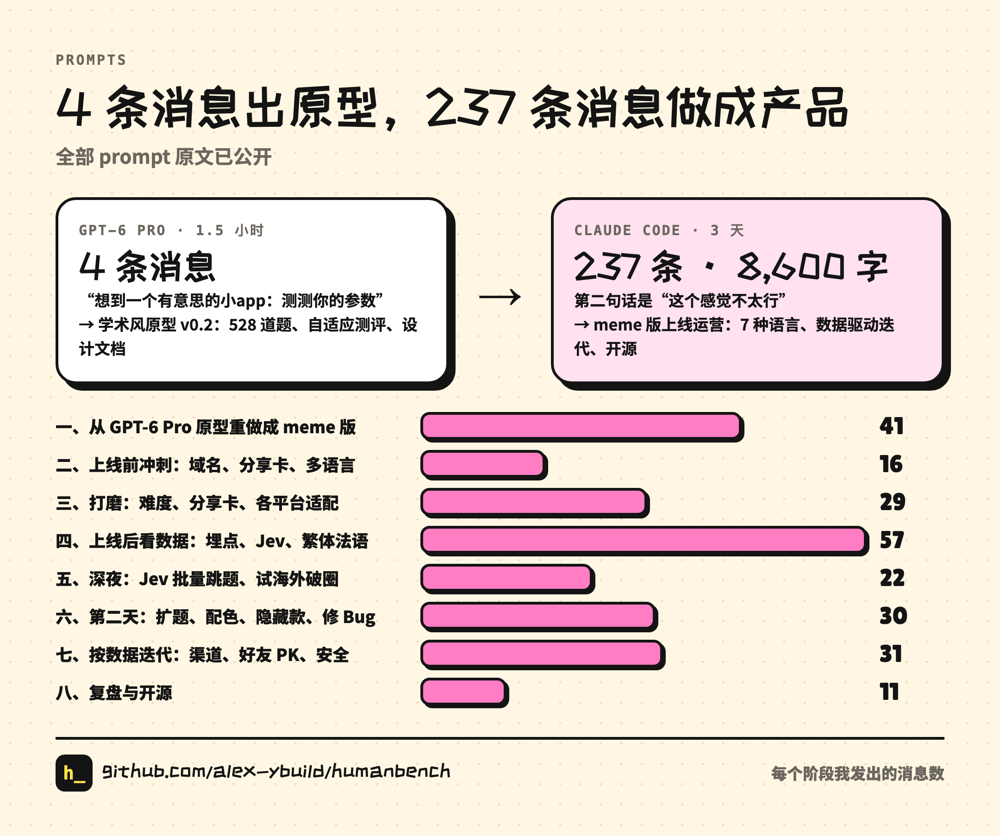

**What I did:**

- **Set the direction.** "This doesn't really work." "You're supposed to play the AI." "Not fewer questions." Every key turn was one short line.
- **Set taste and boundaries.** No emoji, no red and green for right and wrong. Rarity labels only for the secret persona. Don't call it "pulling." The PK card has to be polished and use model names.
- **Be the first player, on my phone.** Overflowing cards, confusing questions, too hard, memes that don't land: most problems I found by playing while out and about.
- **Make the calls, including the wrong ones.** 76 questions was too long. "No A/B" nearly left a regression live.

**What Claude did:**

- **Wrote all the code**, deployed it, fixed the bugs.
- **Turned a feeling into a change you can verify.** I said "don't label stuff all wrong," and it dug up two unrelated formulas. I said "it's too easy to hit AGI," and it simulated its way to the 73% figure, then showed all three knobs were needed.
- **Measured.** Set up tracking, wrote queries, built the per-question drop-off table, ran before/after comparisons, and flagged metric-definition problems before I asked.
- **Ran the pipeline.** For the 46% question-bank expansion, it coordinated a dozen-plus subagent groups at once: writing, editing, translating, final review.
- **Owned its mistakes unprompted.** The half-executed interrupted command, the token showing up in output, the data reading that didn't hold: it brought up every one itself.

**Claude's classic failure modes:**

- Running with the literal words: I said "absorb these tics," and it made tic trivia.
- Overdoing it: I said add some thinking streams, and it added them to scored questions too.
- Replies drifting into English. It took two reminders.
- Giving me credit: the chat at Q3 was its suggestion, and later it said I put it there.

If I had to sum it up in one line: **the human says "this is wrong," the AI makes it right and proves it's right.** In this split, judgment and taste sit with the human. Speed of execution, measurement and correction sit with the AI. We shipped dozens of versions in three days, and every change first ran a full automated playthrough locally (including exporting share cards) and only deployed if it passed.

## 7. Open source

Everything is on GitHub: <https://github.com/alex-ybuild/humanbench>

- **Code**: MIT license. A pure front-end web page plus one Cloudflare Worker (share preview images and analytics). Deploy instructions are in the README.
- **Content**: question bank, chats, translations in 7 languages. CC BY-NC: you can modify and remix it, not use it commercially.
- **All prompts**:
  - The 4 original messages to GPT-6 Pro, and the share link to that conversation.
  - The 237 messages I sent in Claude Code, organized into 8 phases, verbatim, with only personal info removed.
  - The briefs given to subagents in the expansion pipeline: writing, editing, translation, native-speaker final review.
- **Tests and data scripts**: automated full playthrough, screenshot checks, translation structure checks, and the drop-off table queries.

If you want to make your own joke test, take it and change it. If you want to see how one person directed a coding agent to build a product from scratch through conversation alone, the `prompts/` folder might be more direct than these three posts.

## Wrapping up

On the last day, I asked Claude: "hehe but as a campaign it went pretty well, right?"

An account with a few hundred followers, no ads. In three days it got roughly a million impressions, 12.7K people seriously finished 76 questions, and it made it to 96 countries and regions. Traffic has settled back to one or two hundred people an hour. As a bit, it did its job.

For me, the bigger takeaway is the process itself: an idea, a 4-message prototype, a product in 237 messages, dozens of versions changed by data, and then everything made public. Through all of it I did pretty much one thing: tell the AI "this is wrong," then judge whether the fix was right.

Come find out how many B you are, and feel free to take the code and build your own bit.

- Play: <https://humanbench.ybuild.ai>
- Source, question bank, all prompts: <https://github.com/alex-ybuild/humanbench>
- Full illustrated version (all three parts): <https://humanbench.ybuild.ai/retro/en/>

Alex (@Alex_ybuild)
